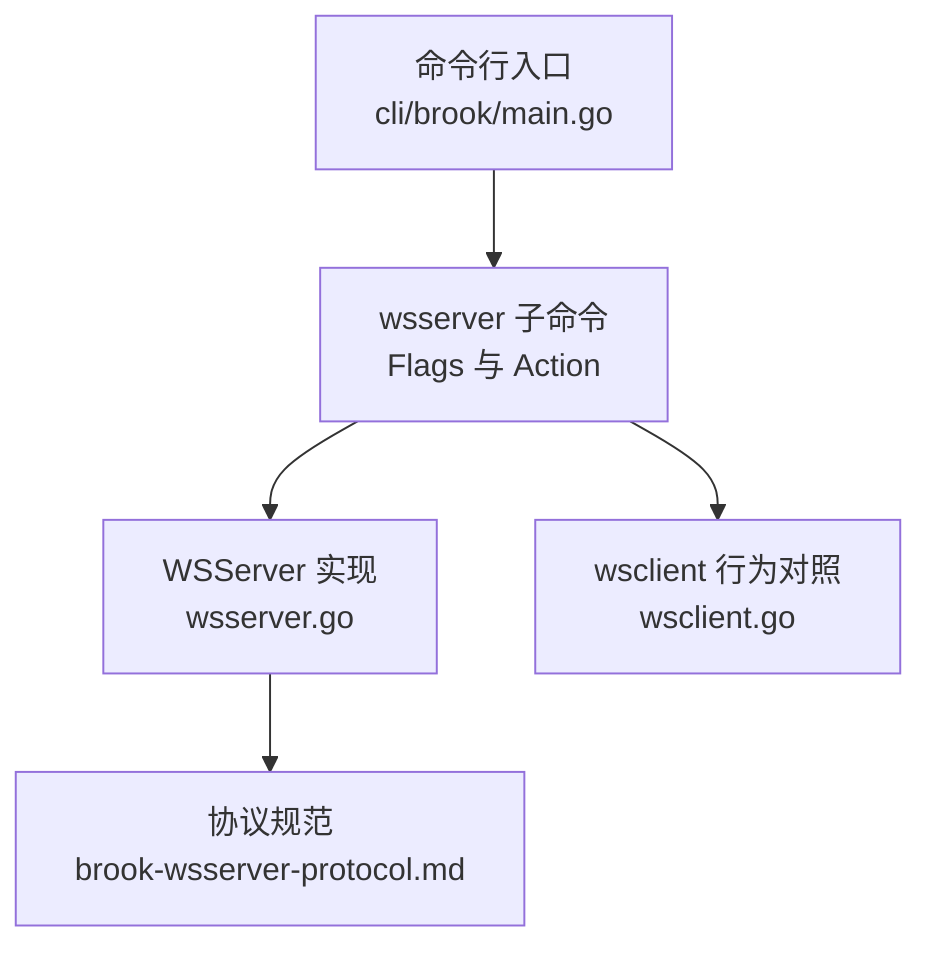
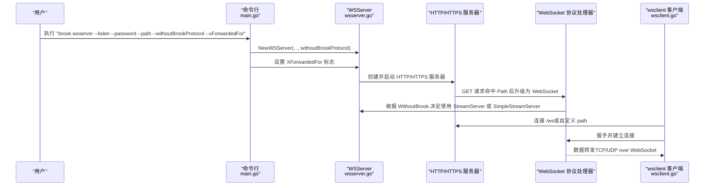
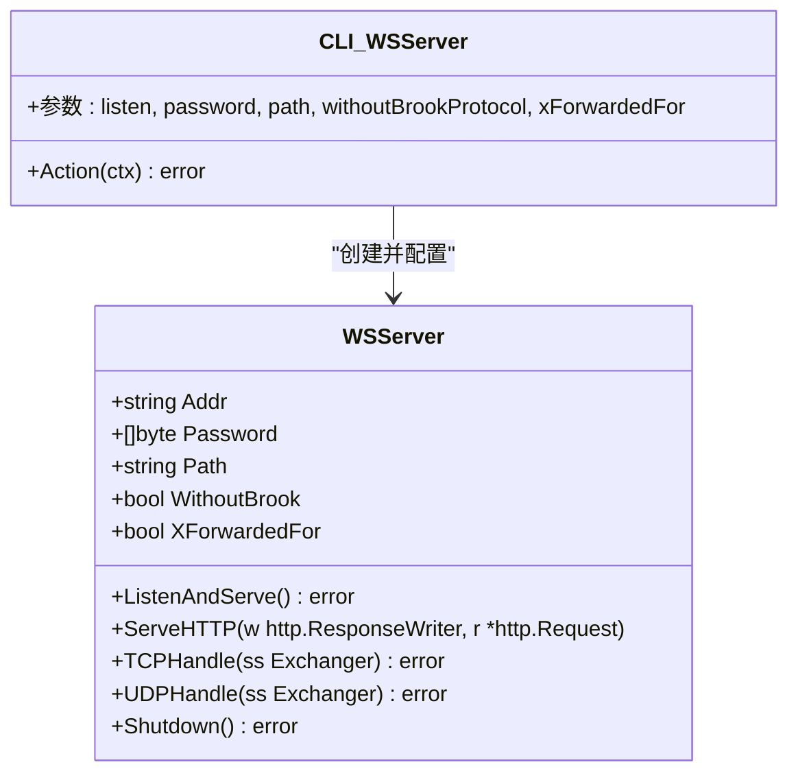

# wsserver命令参数

<cite>
**本文引用的文件**
- [cli/brook/main.go](file://cli/brook/main.go)
- [wsserver.go](file://wsserver.go)
- [brook-wsserver-protocol.md](file://protocol/brook-wsserver-protocol.md)
- [wsclient.go](file://wsclient.go)
</cite>

## 目录
1. [简介](#简介)
2. [项目结构与定位](#项目结构与定位)
3. [核心组件与参数总览](#核心组件与参数总览)
4. [架构概览](#架构概览)
5. [详细参数解析](#详细参数解析)
6. [依赖关系分析](#依赖关系分析)
7. [性能与安全考量](#性能与安全考量)
8. [故障排查指南](#故障排查指南)
9. [结论](#结论)
10. [附录：常见配置模式与最佳实践](#附录常见配置模式与最佳实践)

## 简介
本文件面向使用 Brook 的用户，系统化梳理并解释 wsserver 命令的参数设计与用法，重点覆盖以下参数：
- --listen：监听地址与端口
- --password：服务器密码（用于鉴权）
- --path：WebSocket 路径
- --withoutBrookProtocol：关闭 Brook 协议加密，仅进行基础 WebSocket 传输
- --xForwardedFor：根据代理头替换日志中的来源地址

通过结合命令行实现与服务端代码，本文将阐明这些参数如何共同配置一个 HTTP/WebSocket 服务，以及它们在协议加密、路径设置、代理头处理等方面的交互关系，并给出可复用的配置示例与最佳实践。

## 项目结构与定位
- 命令入口位于命令行子命令定义处，wsserver 子命令在此处声明并绑定 Action。
- 服务端逻辑由 wsserver.go 中的 WSServer 类型与相关方法实现，负责启动 HTTP/HTTPS 服务、路由到 WebSocket 处理器、协议选择与日志来源地址处理。
- 协议细节参考协议文档，描述了 Brook WebSocket 协议的数据帧格式、密钥派生与加解密流程。

图表来源
- [cli/brook/main.go](file://cli/brook/main.go#L528-L646)
- [wsserver.go](file://wsserver.go#L31-L191)
- [brook-wsserver-protocol.md](file://protocol/brook-wsserver-protocol.md#L1-L96)
- [wsclient.go](file://wsclient.go#L41-L86)

章节来源
- [cli/brook/main.go](file://cli/brook/main.go#L528-L646)
- [wsserver.go](file://wsserver.go#L31-L191)

## 核心组件与参数总览
- WSServer 结构体承载服务端运行时状态，包含监听地址、密码、路径、超时、是否启用无 Brook 协议模式、是否启用 X-Forwarded-For 替换等字段。
- NewWSServer 构造函数根据参数初始化 WSServer，并在开启 withoutBrookProtocol 时对密码进行 SHA256 摘要处理，以适配简单流式服务器。
- Action 在命令行层接收参数，创建 WSServer 并设置 XForwardedFor 标志，随后启动服务。

章节来源
- [wsserver.go](file://wsserver.go#L31-L67)
- [cli/brook/main.go](file://cli/brook/main.go#L528-L646)

## 架构概览
下图展示了 wsserver 命令从参数解析到服务启动的关键调用链路，以及与客户端行为的对应关系。

图表来源
- [cli/brook/main.go](file://cli/brook/main.go#L596-L646)
- [wsserver.go](file://wsserver.go#L70-L191)
- [wsclient.go](file://wsclient.go#L41-L86)

## 详细参数解析

### --listen
- 作用：指定 HTTP/WebSocket 服务的监听地址与端口。例如监听所有接口的某个端口。
- 默认值：无默认值，必须显式提供。
- 重要性：若未提供，命令会提示帮助信息。
- 与服务的关系：
  - 当 Domain 为空时，直接以明文 HTTP 方式监听。
  - 当 Domain 非空时，内部会同时监听 80 端口用于 ACME 验证，并在 HTTPS 上提供 WebSocket 服务。
- 取值建议：
  - 生产环境建议使用非特权端口（如 80/443）并配合证书或自动签发。
  - 开发测试可用低权限端口，但需注意浏览器跨域与证书问题。

章节来源
- [cli/brook/main.go](file://cli/brook/main.go#L538-L547)
- [wsserver.go](file://wsserver.go#L70-L138)

### --password
- 作用：服务器侧鉴权密码。客户端连接时需要提供相同密码才能建立连接。
- 默认值：无默认值，必须显式提供。
- 重要性：若未提供，命令会提示帮助信息。
- 与协议的关系：
  - 默认模式下，密码用于派生 KEY，采用 Brook 协议进行数据帧加解密。
  - 当启用 --withoutBrookProtocol 时，密码会被转换为 SHA256 摘要，作为后续简单流式服务器的“密钥”使用。
- 最佳实践：
  - 使用足够强度的密码，避免弱口令。
  - 若需要与不支持 Brook 协议的客户端互通，再考虑开启 withoutBrookProtocol。

章节来源
- [cli/brook/main.go](file://cli/brook/main.go#L543-L547)
- [wsserver.go](file://wsserver.go#L46-L67)

### --path
- 作用：WebSocket 路径，即 HTTP GET 请求升级为 WebSocket 时的 URL 路径。
- 默认值：/ws。
- 与路由的关系：
  - 服务端会注册该路径的 GET 路由，并在请求到达时执行 WebSocket 升级。
- 与客户端的关系：
  - 客户端在未显式指定路径时，默认使用 /ws；若服务端修改了路径，客户端也需保持一致。
- 最佳实践：
  - 将路径设置为不易被扫描发现的值，降低被自动化探测的风险。
  - 与反向代理（如 Nginx）的 location 匹配保持一致。

章节来源
- [cli/brook/main.go](file://cli/brook/main.go#L548-L552)
- [wsserver.go](file://wsserver.go#L70-L77)
- [wsclient.go](file://wsclient.go#L53-L56)

### --withoutBrookProtocol
- 作用：关闭 Brook 协议加密，仅进行基础 WebSocket 传输。此时服务端将使用简单流式服务器处理数据。
- 默认值：false。
- 与密码的关系：
  - 开启后，密码会被转换为 SHA256 摘要，作为简单流式服务器的认证依据。
- 适用场景：
  - 与不支持 Brook 协议的客户端互通。
  - 作为中间层或网关，将流量透传至其他服务。
- 注意事项：
  - 关闭协议加密意味着数据在 WebSocket 层面不再进行加解密，安全性下降，请谨慎使用。
  - 与客户端的 withoutBrookProtocol 必须保持一致。

章节来源
- [cli/brook/main.go](file://cli/brook/main.go#L553-L556)
- [wsserver.go](file://wsserver.go#L46-L67)
- [wsserver.go](file://wsserver.go#L169-L175)

### --xForwardedFor
- 作用：当请求头包含 X-Forwarded-For 且有效时，将日志记录中的来源地址替换为该头指示的真实客户端 IP。
- 默认值：false。
- 安全提醒：
  - 该头可能被伪造，启用后应确保上游可信或配合其他防护措施。
- 日志影响：
  - 主要影响日志输出中的“from”字段，便于审计与统计。
- 最佳实践：
  - 在有可信反向代理（如 Nginx）的生产环境中启用，确保代理正确设置 X-Forwarded-For。

章节来源
- [cli/brook/main.go](file://cli/brook/main.go#L587-L590)
- [wsserver.go](file://wsserver.go#L156-L168)

## 依赖关系分析
- 参数到对象的映射：
  - --listen -> WSServer.Addr
  - --password -> WSServer.Password（默认模式为原始密码，withoutBrookProtocol 模式下为 SHA256）
  - --path -> WSServer.Path
  - --withoutBrookProtocol -> WSServer.WithoutBrook
  - --xForwardedFor -> WSServer.XForwardedFor
- 服务端路由与协议选择：
  - 服务端在启动时注册 GET 路由到指定 Path，并在请求到来时执行 WebSocket 升级。
  - 协议选择逻辑：
    - WithoutBrook=false：使用 StreamServer（默认 Brook 协议）
    - WithoutBrook=true：使用 SimpleStreamServer（无 Brook 协议）
- 客户端行为对照：
  - 客户端在未指定路径时默认使用 /ws；若服务端路径变更，客户端需同步调整。
  - 客户端与服务端的 withoutBrookProtocol 必须保持一致。

图表来源
- [wsserver.go](file://wsserver.go#L31-L191)
- [cli/brook/main.go](file://cli/brook/main.go#L596-L646)

章节来源
- [wsserver.go](file://wsserver.go#L31-L191)
- [cli/brook/main.go](file://cli/brook/main.go#L596-L646)

## 性能与安全考量
- 性能
  - 路由与升级：服务端仅在命中 Path 的 GET 请求上执行 WebSocket 升级，未命中路径的请求返回 404，有助于减少无效连接。
  - 超时设置：可通过 tcpTimeout/udpTimeout 控制连接生命周期，避免资源长期占用。
- 安全
  - 默认 Brook 协议提供数据帧级加解密，增强传输安全性；关闭协议加密会降低整体安全性。
  - X-Forwarded-For 可能被伪造，启用前应确保上游可信。
  - 建议在公网部署时使用 HTTPS 与强密码，并限制访问来源。

[本节为通用指导，不直接分析具体文件]

## 故障排查指南
- 无法连接或握手失败
  - 检查 --listen 是否正确，端口是否被占用。
  - 确认 --path 与客户端一致。
  - 若启用 withoutBrookProtocol，请确保客户端也开启相应选项。
- 日志来源显示异常
  - 若希望显示真实客户端 IP，确认上游代理已正确设置 X-Forwarded-For，并启用 --xForwardedFor。
- 密码错误
  - 确认 --password 与客户端一致；若使用 withoutBrookProtocol，需确保两端均开启。

章节来源
- [cli/brook/main.go](file://cli/brook/main.go#L596-L646)
- [wsserver.go](file://wsserver.go#L156-L168)

## 结论
wsserver 命令通过一组简洁而强大的参数，实现了 HTTP/WebSocket 服务的快速部署与灵活配置。--listen、--password、--path、--withoutBrookProtocol、--xForwardedFor 共同决定了服务的监听方式、鉴权与加密策略、路径匹配以及日志来源的准确性。合理组合这些参数，可以在保证安全性的前提下满足多样化的网络代理需求。

[本节为总结，不直接分析具体文件]

## 附录：常见配置模式与最佳实践

- 模式一：标准 Brook 协议（推荐）
  - 服务端：--listen :80 --password <你的密码> --path /ws
  - 客户端：wsclient 使用相同密码与路径
  - 特点：默认加密，安全性高
- 模式二：无 Brook 协议（兼容性优先）
  - 服务端：--listen :80 --password <你的密码> --path /ws --withoutBrookProtocol
  - 客户端：wsclient 同时开启 withoutBrookProtocol
  - 特点：与不支持 Brook 协议的客户端互通
- 模式三：HTTPS + 自动证书
  - 服务端：--listen :443 --password <你的密码> --path /ws
  - 说明：当 Domain 非空时，服务端会自动申请证书并监听 80 端口用于 ACME 验证
- 模式四：日志来源真实化
  - 服务端：--listen :80 --password <你的密码> --path /ws --xForwardedFor
  - 说明：配合可信反向代理设置 X-Forwarded-For，使日志中的来源地址更准确

章节来源
- [cli/brook/main.go](file://cli/brook/main.go#L528-L646)
- [wsserver.go](file://wsserver.go#L70-L138)
- [wsclient.go](file://wsclient.go#L41-L86)