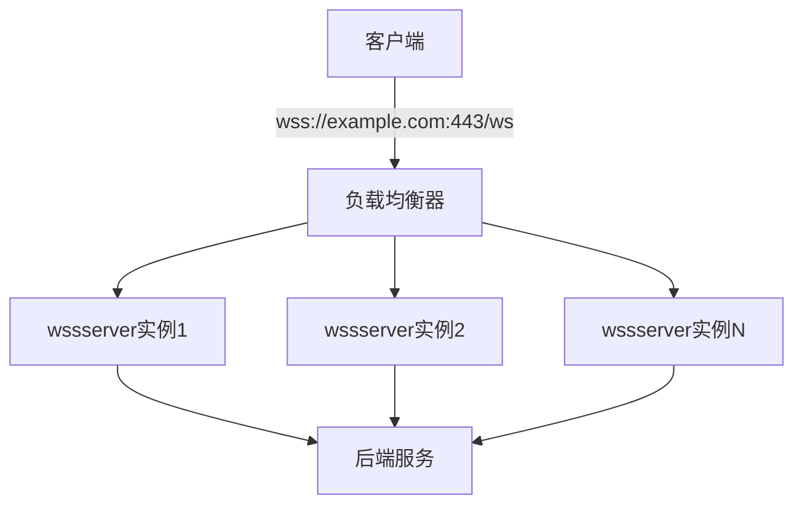
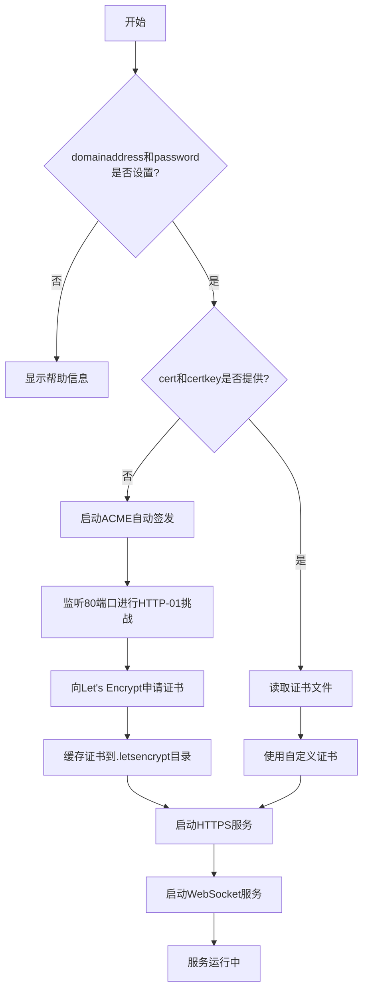

# wssserver命令参数

<cite>
**本文档引用的文件**   
- [main.go](file://cli/brook/main.go)
- [wsserver.go](file://wsserver.go)
</cite>

## 目录
1. [简介](#简介)
2. [核心参数详解](#核心参数详解)
3. [参数配置示例](#参数配置示例)
4. [最佳实践与配置模式](#最佳实践与配置模式)
5. [参数关系与配置流程](#参数关系与配置流程)

## 简介

`wssserver` 命令用于启动一个支持TCP和UDP的安全WebSocket服务器，该服务器同时开启标准的HTTPS服务和WebSocket服务。此命令通过TLS加密确保通信安全，适用于需要通过WebSocket进行安全数据传输的场景。

**Section sources**
- [main.go](file://cli/brook/main.go#L774-L917)

## 核心参数详解

### --domainaddress 参数

`--domainaddress` 参数用于指定服务器的域名和端口，格式为 `domain.com:443`。该参数是wssserver命令的核心配置，决定了服务器对外服务的地址。

当选择自动签发证书时，域名必须已解析到服务器IP，并且80端口也会被用于ACME协议的HTTP-01挑战验证。此参数的域名部分将用于TLS证书的Common Name和Subject Alternative Names，确保客户端能够正确验证服务器身份。

**Section sources**
- [main.go](file://cli/brook/main.go#L784-L786)

### --password 参数

`--password` 参数（可简写为 `-p`）用于设置服务器密码，是客户端连接服务器时进行身份验证的关键凭证。该密码在内部通过SHA256哈希处理，用于生成加密通信的密钥材料。

密码的强度直接影响到通信的安全性，建议使用足够长度和复杂度的密码。该参数与brook协议的HKDF（HMAC-based Key Derivation Function）机制结合，确保每次会话的密钥都是唯一的。

**Section sources**
- [main.go](file://cli/brook/main.go#L788-L791)

### --cert 和 --certkey 参数

`--cert` 和 `--certkey` 参数分别用于指定域名证书文件和私钥文件的绝对路径。这两个参数共同提供了服务器的TLS证书配置。

当 `--cert` 或 `--certkey` 为空时，系统将自动通过Let's Encrypt的ACME协议为指定域名签发证书。证书文件必须是PEM格式，且路径必须为绝对路径。如果提供了自定义证书，系统将直接使用这些文件进行TLS握手；如果未提供，系统将自动处理证书的申请、续期和缓存。

**Section sources**
- [main.go](file://cli/brook/main.go#L793-L798)

### 其他相关参数

- `--path`：指定WebSocket服务的URL路径，默认为 `/ws`。客户端连接时需要使用此路径。
- `--withoutBrookProtocol`：如果设置，数据将不会使用brook协议加密，仅依赖TLS加密。
- `--tcpTimeout` 和 `--udpTimeout`：分别设置TCP和UDP连接的超时时间（秒），0表示无超时。

**Section sources**
- [main.go](file://cli/brook/main.go#L800-L818)

## 参数配置示例

### 自动证书签发配置

```bash
brook wssserver --domainaddress example.com:443 --password mysecretpassword
```

此配置将自动为 `example.com` 域名签发Let's Encrypt证书。系统会自动监听80端口完成ACME挑战，并在 `.letsencrypt` 目录下缓存证书。服务器将在443端口提供HTTPS和WebSocket服务。

### 自定义证书配置

```bash
brook wssserver --domainaddress example.com:443 --password mysecretpassword --cert /path/to/cert.pem --certkey /path/to/certkey.pem
```

此配置使用预先准备好的证书和私钥文件。确保 `/path/to/cert.pem` 和 `/path/to/certkey.pem` 是有效的PEM格式文件，且路径为绝对路径。这种方式适用于使用企业级CA签发的证书或通配符证书。

### 自定义路径配置

```bash
brook wssserver --domainaddress example.com:443 --password mysecretpassword --path /mywebsocket
```

此配置将WebSocket服务的路径从默认的 `/ws` 改为 `/mywebsocket`。客户端连接时需要使用 `wss://example.com:443/mywebsocket` 地址。

**Section sources**
- [main.go](file://cli/brook/main.go#L846-L847)

## 最佳实践与配置模式

### 安全性最佳实践

1. **强密码策略**：使用至少12个字符的密码，包含大小写字母、数字和特殊字符。
2. **证书管理**：优先使用自动证书签发功能，确保证书的及时更新和有效性。
3. **端口安全**：确保80端口仅用于ACME挑战，完成后可考虑通过防火墙限制访问。

### 高可用性配置



**Diagram sources**
- [main.go](file://cli/brook/main.go#L774-L917)

在生产环境中，建议将wssserver部署在负载均衡器后方，实现高可用和横向扩展。

### 自动化运维

利用自动证书签发功能，可以实现零运维的证书管理。系统会自动处理证书的申请、续期（通常在证书到期前30天自动续期）和错误重试，大大降低了运维复杂度。

## 参数关系与配置流程



**Diagram sources**
- [main.go](file://cli/brook/main.go#L849-L850)
- [wsserver.go](file://wsserver.go#L98-L119)

配置流程清晰地展示了各参数之间的逻辑关系。`--domainaddress` 和 `--password` 是必需参数，而 `--cert` 和 `--certkey` 是可选的，它们的存在决定了证书的来源（自定义或自动签发）。整个流程确保了服务器能够安全、可靠地启动并提供服务。

**Section sources**
- [main.go](file://cli/brook/main.go#L844-L917)
- [wsserver.go](file://wsserver.go#L69-L137)