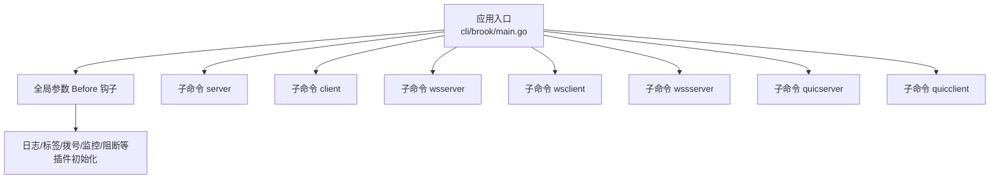
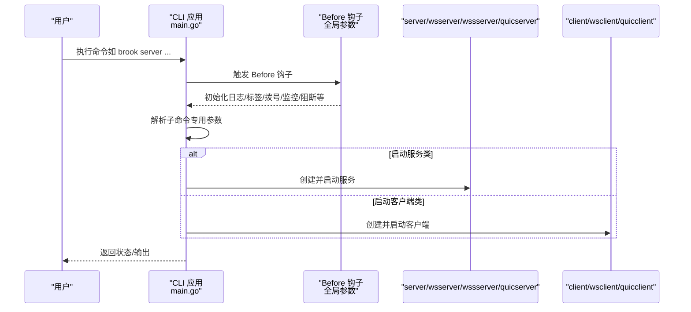
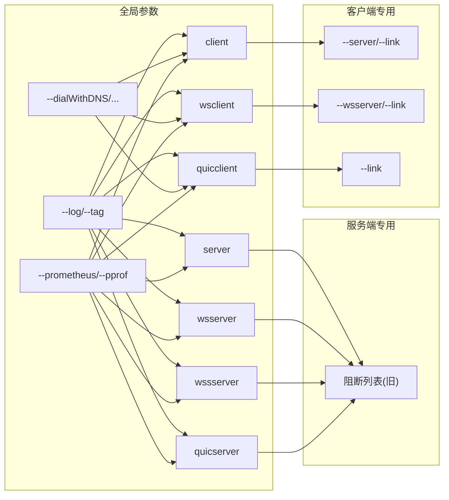

# 命令特定参数

<cite>
**本文引用的文件**
- [cli/brook/main.go](file://cli/brook/main.go)
</cite>

## 目录
1. [简介](#简介)
2. [项目结构](#项目结构)
3. [核心组件](#核心组件)
4. [架构总览](#架构总览)
5. [详细组件分析](#详细组件分析)
6. [依赖关系分析](#依赖关系分析)
7. [性能考量](#性能考量)
8. [故障排查指南](#故障排查指南)
9. [结论](#结论)
10. [附录：命令与参数速查](#附录命令与参数速查)

## 简介
本文件聚焦于 Brook 工具在命令行层面的“命令特定参数”，系统化梳理 server、client、wsserver、wsclient、wssserver、quicserver 等核心子命令的专用配置项，并说明其与全局参数的关系、行为影响与最佳实践。内容完全基于仓库中的命令定义与实现逻辑整理，避免臆测，便于不同技术背景的用户快速上手与排障。

## 项目结构
- 命令入口位于 cli/brook/main.go，通过 urfave/cli 定义应用、全局标志与各子命令。
- 各命令的 Flags 在各自 Command 的 Flags 列表中声明，Action 中解析并调用对应服务或客户端初始化函数。
- 全局参数（如日志、pprof、标签、拨号策略、Prometheus、阻断列表等）在 Before 钩子中统一处理，影响所有命令。

图表来源
- [cli/brook/main.go](file://cli/brook/main.go#L51-L160)

章节来源
- [cli/brook/main.go](file://cli/brook/main.go#L51-L160)

## 核心组件
- 全局参数（Before 钩子）
  - 日志与标签：--log、--tag
  - 拨号策略：--dialWithDNS、--dialWithDNSPrefer、--dialWithIP4、--dialWithIP6、--dialWithNIC、--dialWithSocks5、--dialWithSocks5Username、--dialWithSocks5Password、--dialWithSocks5TCPTimeout、--dialWithSocks5UDPTimeout
  - 性能与调试：--pprof、--prometheus、--prometheusPath
  - 协议信息：--clientHKDFInfo、--serverHKDFInfo
  - 阻断列表：--blockDomainList、--blockCIDR4List、--blockCIDR6List、--blockGeoIP、--blockListUpdateInterval
  - 进程控制：--pid
- 子命令专用参数
  - server：--listen、--password、--tcpTimeout、--udpTimeout、--blockDomainList、--blockCIDR4List、--blockCIDR6List、--blockGeoIP、--updateListInterval、--example
  - client：--server、--password、--link、--socks5、--socks5ServerIP、--http、--tcpTimeout、--udpTimeout、--example
  - wsserver：--listen、--password、--path、--withoutBrookProtocol、--tcpTimeout、--udpTimeout、--blockDomainList、--blockCIDR4List、--blockCIDR6List、--blockGeoIP、--updateListInterval、--xForwardedFor、--example
  - wsclient：--wsserver、--password、--link、--socks5、--socks5ServerIP、--http、--tcpTimeout、--udpTimeout、--example
  - wssserver：--domainaddress、--password、--cert、--certkey、--path、--withoutBrookProtocol、--tcpTimeout、--udpTimeout、--blockDomainList、--blockCIDR4List、--blockCIDR6List、--blockGeoIP、--updateListInterval、--example
  - quicserver：--domainaddress、--password、--cert、--certkey、--withoutBrookProtocol、--tcpTimeout、--udpTimeout、--blockDomainList、--blockCIDR4List、--blockCIDR6List、--blockGeoIP、--updateListInterval、--example
  - quicclient：--link、--socks5、--socks5ServerIP、--http、--tcpTimeout、--udpTimeout、--example

章节来源
- [cli/brook/main.go](file://cli/brook/main.go#L66-L163)
- [cli/brook/main.go](file://cli/brook/main.go#L296-L401)
- [cli/brook/main.go](file://cli/brook/main.go#L403-L526)
- [cli/brook/main.go](file://cli/brook/main.go#L528-L646)
- [cli/brook/main.go](file://cli/brook/main.go#L648-L771)
- [cli/brook/main.go](file://cli/brook/main.go#L773-L917)
- [cli/brook/main.go](file://cli/brook/main.go#L1044-L1183)
- [cli/brook/main.go](file://cli/brook/main.go#L1185-L1290)

## 架构总览
下图展示命令参数与执行流程的关系：全局 Before 钩子负责初始化通用能力；各子命令 Action 负责解析自身专用参数并启动对应服务或客户端。

图表来源
- [cli/brook/main.go](file://cli/brook/main.go#L164-L295)
- [cli/brook/main.go](file://cli/brook/main.go#L296-L401)
- [cli/brook/main.go](file://cli/brook/main.go#L403-L526)
- [cli/brook/main.go](file://cli/brook/main.go#L528-L646)
- [cli/brook/main.go](file://cli/brook/main.go#L648-L771)
- [cli/brook/main.go](file://cli/brook/main.go#L773-L917)
- [cli/brook/main.go](file://cli/brook/main.go#L1044-L1183)
- [cli/brook/main.go](file://cli/brook/main.go#L1185-L1290)

## 详细组件分析

### server 命令
- 专用参数
  - --listen/-l：监听地址（如 :9999）
  - --password/-p：服务器密码
  - --tcpTimeout：TCP 超时秒数
  - --udpTimeout：UDP 超时秒数
  - --blockDomainList/--blockCIDR4List/--blockCIDR6List/--blockGeoIP：阻断列表（已标注为未来版本建议使用全局参数）
  - --updateListInterval：阻断列表更新间隔（已标注为未来版本建议使用全局参数）
  - --example：打印最小示例
- 行为说明
  - 必须同时提供 --listen 和 --password，否则提示帮助
  - 支持阻断列表（兼容旧参数），支持按间隔自动更新
  - 使用超时参数控制连接空闲回收
- 最佳实践
  - 生产环境建议配合全局阻断列表参数集中管理
  - UDP 超时根据网络环境适当增大
  - 结合全局日志与标签定位问题

章节来源
- [cli/brook/main.go](file://cli/brook/main.go#L296-L401)

### client 命令
- 专用参数
  - --server/-s：目标服务器地址（如 1.2.3.4:9999）
  - --password/-p：服务器密码
  - --link：brook 链接（优先级高于 --server）
  - --socks5：本地 SOCKS5 监听地址（默认 127.0.0.1:1080）
  - --socks5ServerIP：当本地监听 IP 与服务器实际 IP 不一致时指定
  - --http：可选 HTTP 代理监听地址
  - --tcpTimeout：TCP 超时秒数
  - --udpTimeout：UDP 超时秒数
  - --example：打印最小示例
- 行为说明
  - 必须提供 --server 或 --link 之一
  - 若提供 --link，则忽略 --password
  - 解析链接中的 HKDF 信息以保持协议一致性
  - 可同时开启 SOCKS5 与 HTTP 代理
- 最佳实践
  - 优先使用 --link 以复用已有配置
  - UDP 场景必须明确指定 --socks5ServerIP
  - 结合全局拨号参数优化出口链路

章节来源
- [cli/brook/main.go](file://cli/brook/main.go#L403-L526)

### wsserver 命令
- 专用参数
  - --listen/-l：监听地址（如 :80）
  - --password/-p：服务器密码
  - --path：URL 路径（默认 /ws）
  - --withoutBrookProtocol：关闭 Brook 协议加密
  - --tcpTimeout：TCP 超时秒数
  - --udpTimeout：UDP 超时秒数
  - --blockDomainList/--blockCIDR4List/--blockCIDR6List/--blockGeoIP：阻断列表（兼容旧参数）
  - --updateListInterval：阻断列表更新间隔（兼容旧参数）
  - --xForwardedFor：从日志中替换来源字段（注意可能被伪造）
  - --example：打印最小示例
- 行为说明
  - 必须同时提供 --listen 和 --password
  - 支持阻断列表与自动更新
  - 可选择不使用 Brook 协议加密（仅在特殊场景需要）
- 最佳实践
  - 默认启用 Brook 协议加密
  - 如需伪装 HTTP 流量，结合 --path 与 --xForwardedFor
  - 生产环境建议配合全局阻断列表参数

章节来源
- [cli/brook/main.go](file://cli/brook/main.go#L528-L646)

### wsclient 命令
- 专用参数
  - --wsserver/-s：目标 wsserver 地址（如 ws://1.2.3.4:80，未指定路径则使用 /ws）
  - --password/-p：服务器密码
  - --link：brook 链接（优先级高于 --wsserver）
  - --socks5：本地 SOCKS5 监听地址（默认 127.0.0.1:1080）
  - --socks5ServerIP：当本地监听 IP 与服务器实际 IP 不一致时指定
  - --http：可选 HTTP 代理监听地址
  - --tcpTimeout：TCP 超时秒数
  - --udpTimeout：UDP 超时秒数
  - --example：打印最小示例
- 行为说明
  - 必须提供 --wsserver 或 --link 之一
  - 解析链接中的 HKDF 信息以保持协议一致性
  - 可同时开启 SOCKS5 与 HTTP 代理
- 最佳实践
  - 优先使用 --link
  - UDP 场景必须明确指定 --socks5ServerIP
  - 配合全局拨号参数优化出口链路

章节来源
- [cli/brook/main.go](file://cli/brook/main.go#L648-L771)

### wssserver 命令
- 专用参数
  - --domainaddress：域名:端口（如 domain.com:443），用于自动签发证书
  - --password/-p：服务器密码
  - --cert/--certkey：证书与私钥绝对路径（为空则自动签发）
  - --path：URL 路径（默认 /ws）
  - --withoutBrookProtocol：关闭 Brook 协议加密
  - --tcpTimeout：TCP 超时秒数
  - --udpTimeout：UDP 超时秒数
  - --blockDomainList/--blockCIDR4List/--blockCIDR6List/--blockGeoIP：阻断列表（兼容旧参数）
  - --updateListInterval：阻断列表更新间隔（兼容旧参数）
  - --example：打印最小示例
- 行为说明
  - 必须同时提供 --domainaddress 和 --password
  - 支持阻断列表与自动更新
  - 可选择不使用 Brook 协议加密
  - 证书路径必须为绝对路径
- 最佳实践
  - 域名解析到服务器 IP，且 80 端口可用以便自动签发
  - 生产环境建议配合全局阻断列表参数
  - 证书与私钥路径必须为绝对路径

章节来源
- [cli/brook/main.go](file://cli/brook/main.go#L773-L917)

### quicserver 命令
- 专用参数
  - --domainaddress：域名:端口（如 domain.com:443），用于自动签发证书
  - --password/-p：服务器密码
  - --cert/--certkey：证书与私钥绝对路径（为空则自动签发）
  - --withoutBrookProtocol：关闭 Brook 协议加密
  - --tcpTimeout：TCP 超时秒数
  - --udpTimeout：UDP 超时秒数
  - --blockDomainList/--blockCIDR4List/--blockCIDR6List/--blockGeoIP：阻断列表（兼容旧参数）
  - --updateListInterval：阻断列表更新间隔（兼容旧参数）
  - --example：打印最小示例
- 行为说明
  - 必须同时提供 --domainaddress 和 --password
  - 支持阻断列表与自动更新
  - 可选择不使用 Brook 协议加密
  - 证书路径必须为绝对路径
- 最佳实践
  - 域名解析到服务器 IP，且 80 端口可用以便自动签发
  - 生产环境建议配合全局阻断列表参数
  - 证书与私钥路径必须为绝对路径

章节来源
- [cli/brook/main.go](file://cli/brook/main.go#L1044-L1183)

### quicclient 命令
- 专用参数
  - --link：brook 链接（优先级最高）
  - --socks5：本地 SOCKS5 监听地址（默认 127.0.0.1:1080）
  - --socks5ServerIP：当本地监听 IP 与服务器实际 IP 不一致时指定
  - --http：可选 HTTP 代理监听地址
  - --tcpTimeout：TCP 超时秒数
  - --udpTimeout：UDP 超时秒数
  - --example：打印最小示例
- 行为说明
  - 必须提供 --link
  - 解析链接中的 HKDF 信息以保持协议一致性
  - 可同时开启 SOCKS5 与 HTTP 代理
  - 全局拨号参数会被忽略（以链接为准）
- 最佳实践
  - 优先使用 --link
  - UDP 场景必须明确指定 --socks5ServerIP
  - 配合全局拨号参数优化出口链路（若链接未覆盖）

章节来源
- [cli/brook/main.go](file://cli/brook/main.go#L1185-L1290)

## 依赖关系分析
- 参数耦合
  - server/client 与 wsserver/wsclient/wssserver/quicserver/quicclient 的密码与链接参数存在互斥与继承关系
  - 阻断列表参数在服务端命令中既支持旧参数也支持全局参数（旧参数标注为未来移除）
  - socks5ServerIP 对 UDP 场景是必需的
- 外部依赖
  - TLS 证书（wssserver、quicserver）
  - 拨号策略（DNS/IP/NIC/SOCKS5）
  - Prometheus/日志/PPROF 插件（全局）

图表来源
- [cli/brook/main.go](file://cli/brook/main.go#L66-L163)
- [cli/brook/main.go](file://cli/brook/main.go#L296-L401)
- [cli/brook/main.go](file://cli/brook/main.go#L403-L526)
- [cli/brook/main.go](file://cli/brook/main.go#L528-L646)
- [cli/brook/main.go](file://cli/brook/main.go#L648-L771)
- [cli/brook/main.go](file://cli/brook/main.go#L773-L917)
- [cli/brook/main.go](file://cli/brook/main.go#L1044-L1183)
- [cli/brook/main.go](file://cli/brook/main.go#L1185-L1290)

## 性能考量
- 超时参数
  - --tcpTimeout、--udpTimeout 控制空闲连接回收，合理设置可降低资源占用
- 拨号策略
  - 通过 --dialWithDNS、--dialWithIP4/6、--dialWithNIC、--dialWithSocks5 等优化出口链路质量
- 监控与调试
  - --pprof、--prometheus、--prometheusPath 用于运行时观测
- 协议开销
  - --withoutBrookProtocol 会关闭协议加密，减少 CPU 开销但降低安全性

[本节为通用指导，无需列出具体文件来源]

## 故障排查指南
- 常见错误与定位
  - 缺少必要参数：如 server 必须提供 --listen 与 --password；client/wsclient/quicclient 必须提供 --server/--wsserver/--link 之一
  - 绝对路径校验：--log、--pid、阻断列表文件、证书与私钥路径必须为绝对路径
  - socks5 UDP 必须明确指定 --socks5ServerIP
  - 阻断列表路径格式校验：必须为 http(s):// 或绝对路径
- 排查步骤
  - 使用 --example 快速验证参数组合
  - 结合 --log 与 --tag 输出定位问题
  - 使用 --pprof 与 --prometheus 观察运行状态
  - 通过全局拨号参数调整出口链路后重试

章节来源
- [cli/brook/main.go](file://cli/brook/main.go#L164-L295)
- [cli/brook/main.go](file://cli/brook/main.go#L296-L401)
- [cli/brook/main.go](file://cli/brook/main.go#L403-L526)
- [cli/brook/main.go](file://cli/brook/main.go#L528-L646)
- [cli/brook/main.go](file://cli/brook/main.go#L648-L771)
- [cli/brook/main.go](file://cli/brook/main.go#L773-L917)
- [cli/brook/main.go](file://cli/brook/main.go#L1044-L1183)
- [cli/brook/main.go](file://cli/brook/main.go#L1185-L1290)

## 结论
- server/client/wsserver/wsclient/wssserver/quicserver 的专用参数清晰区分了监听、认证、代理、超时与阻断等关键维度
- 全局参数在 Before 钩子中集中初始化，确保跨命令的一致性与可观测性
- 建议优先使用 --link 与全局阻断列表参数，简化运维与提升一致性
- UDP 场景务必明确指定 --socks5ServerIP，避免连接异常

[本节为总结性内容，无需列出具体文件来源]

## 附录：命令与参数速查
- server
  - --listen/-l、--password/-p、--tcpTimeout、--udpTimeout、--blockDomainList、--blockCIDR4List、--blockCIDR6List、--blockGeoIP、--updateListInterval、--example
- client
  - --server/-s、--password/-p、--link、--socks5、--socks5ServerIP、--http、--tcpTimeout、--udpTimeout、--example
- wsserver
  - --listen/-l、--password/-p、--path、--withoutBrookProtocol、--tcpTimeout、--udpTimeout、--blockDomainList、--blockCIDR4List、--blockCIDR6List、--blockGeoIP、--updateListInterval、--xForwardedFor、--example
- wsclient
  - --wsserver/-s、--password/-p、--link、--socks5、--socks5ServerIP、--http、--tcpTimeout、--udpTimeout、--example
- wssserver
  - --domainaddress、--password/-p、--cert、--certkey、--path、--withoutBrookProtocol、--tcpTimeout、--udpTimeout、--blockDomainList、--blockCIDR4List、--blockCIDR6List、--blockGeoIP、--updateListInterval、--example
- quicserver
  - --domainaddress、--password/-p、--cert、--certkey、--withoutBrookProtocol、--tcpTimeout、--udpTimeout、--blockDomainList、--blockCIDR4List、--blockCIDR6List、--blockGeoIP、--updateListInterval、--example
- quicclient
  - --link、--socks5、--socks5ServerIP、--http、--tcpTimeout、--udpTimeout、--example

章节来源
- [cli/brook/main.go](file://cli/brook/main.go#L296-L401)
- [cli/brook/main.go](file://cli/brook/main.go#L403-L526)
- [cli/brook/main.go](file://cli/brook/main.go#L528-L646)
- [cli/brook/main.go](file://cli/brook/main.go#L648-L771)
- [cli/brook/main.go](file://cli/brook/main.go#L773-L917)
- [cli/brook/main.go](file://cli/brook/main.go#L1044-L1183)
- [cli/brook/main.go](file://cli/brook/main.go#L1185-L1290)