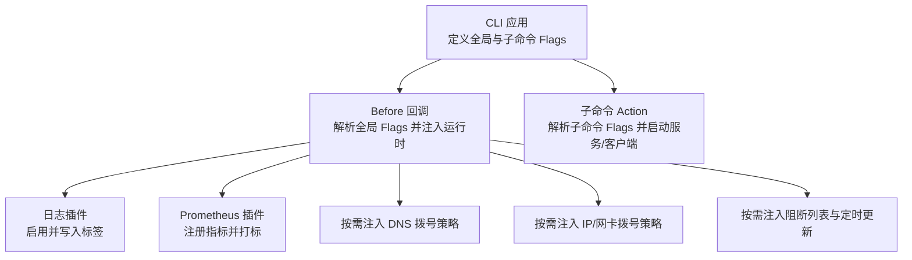
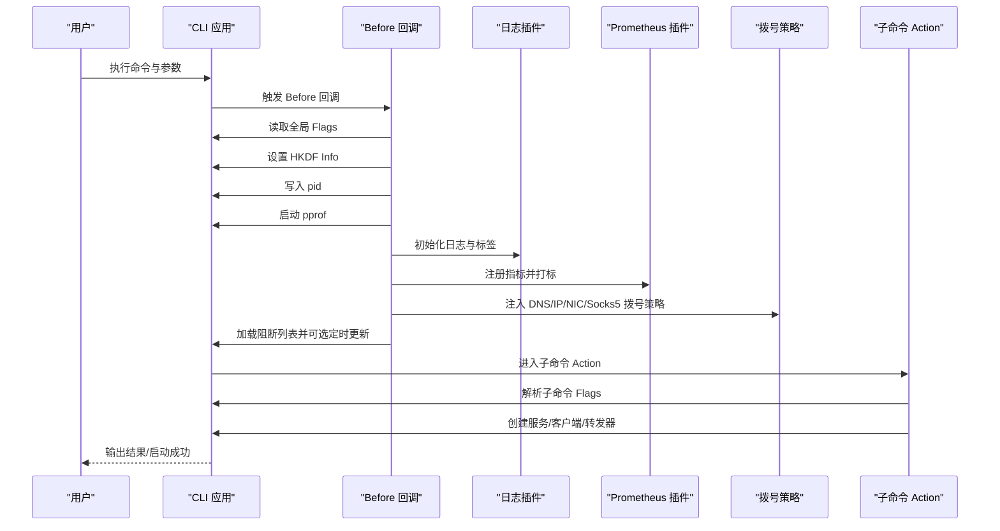
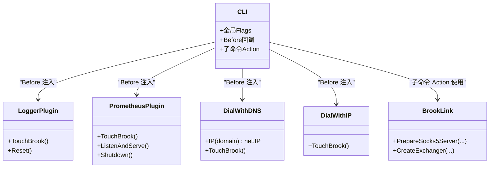

# 配置与参数

<cite>
**本文引用的文件**
- [cli/brook/main.go](file://cli/brook/main.go)
- [init.go](file://init.go)
- [brooklink.go](file://brooklink.go)
- [link.go](file://link.go)
- [plugins/logger/logger.go](file://plugins/logger/logger.go)
- [plugins/prometheus/prometheus.go](file://plugins/prometheus/prometheus.go)
- [plugins/dialwithdns/dialwithdns.go](file://plugins/dialwithdns/dialwithdns.go)
- [plugins/dialwithip/dialwithip.go](file://plugins/dialwithip/dialwithip.go)
</cite>

## 目录
1. [简介](#简介)
2. [项目结构与配置入口](#项目结构与配置入口)
3. [配置体系总览](#配置体系总览)
4. [架构与控制流概览](#架构与控制流概览)
5. [详细配置项解析](#详细配置项解析)
6. [依赖关系与耦合分析](#依赖关系与耦合分析)
7. [性能与可靠性考量](#性能与可靠性考量)
8. [故障排查指南](#故障排查指南)
9. [结论](#结论)

## 简介
本文件面向使用 brook 的用户与运维人员，系统化梳理 CLI 参数配置体系，覆盖通用参数与各子命令的特定参数；明确配置优先级（命令行参数 > 环境变量 > 默认值）；结合初始化逻辑说明配置如何影响系统行为，并给出最佳实践建议与排障要点。

## 项目结构与配置入口
- CLI 入口位于命令行程序，通过 urfave/cli 定义全局 Flags 与各子命令 Flags。
- 初始化阶段在 Before 回调中读取全局 Flags 并注入到核心运行时（日志、指标、拨号策略等）。
- 子命令 Action 中读取自身 Flags，并根据 Flags 构造服务或客户端实例。

图表来源
- [cli/brook/main.go](file://cli/brook/main.go#L51-L295)
- [plugins/logger/logger.go](file://plugins/logger/logger.go#L76-L134)
- [plugins/prometheus/prometheus.go](file://plugins/prometheus/prometheus.go#L50-L93)
- [plugins/dialwithdns/dialwithdns.go](file://plugins/dialwithdns/dialwithdns.go#L121-L145)
- [plugins/dialwithip/dialwithip.go](file://plugins/dialwithip/dialwithip.go#L47-L99)

章节来源
- [cli/brook/main.go](file://cli/brook/main.go#L51-L295)

## 配置体系总览
- 通用参数（全局 Flags）
  - 运行期调试与可观测性：pprof、log、tag、prometheus、prometheusPath
  - 拨号策略：dialWithDNS、dialWithDNSPrefer、dialWithIP4、dialWithIP6、dialWithNIC、dialWithSocks5 及其超时与认证
  - 协议与安全：clientHKDFInfo、serverHKDFInfo、withoutBrookProtocol、insecure、ca、tlsfingerprint、fragment、token
  - 内容阻断：blockDomainList、blockCIDR4List、blockCIDR6List、blockGeoIP、blockListUpdateInterval
  - 进程与文件：pid
- 子命令特定参数
  - server/wsserver/wssserver/quicserver：监听地址、密码、超时、路径、证书、TLS指纹、阻断列表等
  - client/wsclient/wssclient/quicclient/relayoverbrook：目标服务器/链接、本地代理监听、超时、HTTP 转换等
  - dnsserveroverbrook/dnsserver/dohserver/dohclient：DNS/DoH 解析器、域名白黑名单、禁用记录类型、超时等
  - link/connect/relay/pac/socks5/socks5tohttp/testsocks5/testbrook/echoserver/echoclient/ipcountry/completion/mdpage/manpage 等：各自专用参数

章节来源
- [cli/brook/main.go](file://cli/brook/main.go#L66-L161)
- [cli/brook/main.go](file://cli/brook/main.go#L296-L2399)
- [cli/brook/main.go](file://cli/brook/main.go#L2400-L2962)

## 架构与控制流概览
- 启动流程
  - CLI 初始化应用与全局 Flags
  - Before 回调解析全局 Flags：
    - 设置 HKDF Info
    - 写入 pid 文件
    - 启动 pprof
    - 初始化日志与标签
    - 注入 DNS/IPv4/IPv6/网卡/代理拨号策略
    - 启动 Prometheus 并注册指标
    - 加载阻断列表并可选定时更新
  - 子命令 Action 解析自身 Flags 并创建对应组件（服务端/客户端/转发器/代理等）
- 链接生成与解析
  - link 命令将 server 类型、密码、用户名、名称、协议开关、证书、指纹、片段、token 等编码为 brook:// 链接
  - connect/各客户端命令解析链接，动态覆盖 HKDF Info，并据此选择底层传输（TCP/UDP/WS/QUIC）

图表来源
- [cli/brook/main.go](file://cli/brook/main.go#L164-L295)
- [plugins/logger/logger.go](file://plugins/logger/logger.go#L76-L134)
- [plugins/prometheus/prometheus.go](file://plugins/prometheus/prometheus.go#L50-L93)
- [plugins/dialwithdns/dialwithdns.go](file://plugins/dialwithdns/dialwithdns.go#L121-L145)
- [plugins/dialwithip/dialwithip.go](file://plugins/dialwithip/dialwithip.go#L47-L99)

章节来源
- [cli/brook/main.go](file://cli/brook/main.go#L164-L295)
- [brooklink.go](file://brooklink.go#L54-L147)
- [link.go](file://link.go#L22-L38)

## 详细配置项解析

### 通用参数（全局 Flags）
- pprof
  - 作用：启用 Go pprof HTTP 服务，便于性能分析
  - 优先级：命令行 > 环境变量 > 默认值
  - 注意：若指定，将在 Before 中启动监听
- log
  - 作用：启用日志输出，支持 console 或绝对路径文件
  - 优先级：命令行 > 环境变量 > 默认值
  - 行为：Before 中校验路径合法性并初始化日志插件，支持标签注入
- tag
  - 作用：为日志与指标打上键值对标签
  - 优先级：命令行 > 环境变量 > 默认值
  - 格式：key:value 多次出现
- dialWithDNS / dialWithDNSPrefer
  - 作用：强制域名解析使用指定 DNS（支持 UDP/TCP 或 DoH），可指定 A/AAAA 优先
  - 优先级：命令行 > 环境变量 > 默认值
  - 行为：Before 中注入 Resolve，影响后续 TCP/UDP 拨号
- dialWithIP4 / dialWithIP6
  - 作用：强制出站使用指定 IPv4/IPv6 作为本地源地址
  - 优先级：命令行 > 环境变量 > 默认值
  - 行为：Before 中替换 DialTCP/DialUDP，按目的地址族选择源地址
- dialWithNIC
  - 作用：强制出站绑定到指定网卡
  - 优先级：命令行 > 环境变量 > 默认值
  - 行为：与 IP 组合使用时，优先级由实现决定（通常以 IP 为准）
- dialWithSocks5 / dialWithSocks5Username / dialWithSocks5Password
  - 作用：通过 SOCKS5 代理出站
  - 优先级：命令行 > 环境变量 > 默认值
  - dialWithSocks5TCPTimeout / dialWithSocks5UDPTimeout：TCP/UDP 超时秒数
- prometheus / prometheusPath
  - 作用：启用 Prometheus HTTP 服务并暴露指标，路径必填
  - 优先级：命令行 > 环境变量 > 默认值
  - 行为：Before 中启动 HTTP 服务并注册指标，打上标签
- clientHKDFInfo / serverHKDFInfo
  - 作用：用于协议派生密钥，需客户端与服务端一致
  - 优先级：命令行 > 环境变量 > 默认值
  - 影响：Before 与各客户端 Action 中会设置全局 HKDF Info
- blockDomainList / blockCIDR4List / blockCIDR6List / blockGeoIP / blockListUpdateInterval
  - 作用：内容阻断（域名后缀匹配、IPv4/IPv6 CIDR、国家代码），可定时更新
  - 优先级：命令行 > 环境变量 > 默认值
  - 行为：Before 中加载阻断列表并可选定时更新
- pid
  - 作用：写入进程 PID 文件，便于外部管理
  - 优先级：命令行 > 环境变量 > 默认值
  - 行为：Before 中校验绝对路径并写入

章节来源
- [cli/brook/main.go](file://cli/brook/main.go#L66-L163)
- [cli/brook/main.go](file://cli/brook/main.go#L164-L295)
- [plugins/logger/logger.go](file://plugins/logger/logger.go#L76-L134)
- [plugins/prometheus/prometheus.go](file://plugins/prometheus/prometheus.go#L50-L93)
- [plugins/dialwithdns/dialwithdns.go](file://plugins/dialwithdns/dialwithdns.go#L121-L145)
- [plugins/dialwithip/dialwithip.go](file://plugins/dialwithip/dialwithip.go#L47-L99)

### 子命令特定参数

#### server
- 必要参数：listen、password
- 可选参数：tcpTimeout、udpTimeout、blockDomainList、blockCIDR4List、blockCIDR6List、blockGeoIP、updateListInterval、example
- 行为：创建服务端实例并启动监听；支持阻断列表与定时更新

章节来源
- [cli/brook/main.go](file://cli/brook/main.go#L296-L401)

#### client
- 必要参数：server 或 link（二选一）
- 可选参数：password、socks5、socks5ServerIP、http、tcpTimeout、udpTimeout、example
- 行为：解析链接（含 clientHKDFInfo/serverHKDFInfo），准备本地 SOCKS5 代理，可选开启 HTTP 转换

章节来源
- [cli/brook/main.go](file://cli/brook/main.go#L403-L526)
- [brooklink.go](file://brooklink.go#L54-L147)

#### wsserver
- 必要参数：listen、password
- 可选参数：path、withoutBrookProtocol、tcpTimeout、udpTimeout、blockDomainList、blockCIDR4List、blockCIDR6List、blockGeoIP、updateListInterval、xForwardedFor、example
- 行为：创建 WebSocket 服务端，支持 TLS 与可选协议加密；支持阻断列表与定时更新

章节来源
- [cli/brook/main.go](file://cli/brook/main.go#L528-L646)

#### wsclient
- 必要参数：wsserver 或 link（二选一）
- 可选参数：password、socks5、socks5ServerIP、http、tcpTimeout、udpTimeout、example
- 行为：解析链接，准备本地 SOCKS5 代理，可选开启 HTTP 转换

章节来源
- [cli/brook/main.go](file://cli/brook/main.go#L648-L771)
- [brooklink.go](file://brooklink.go#L54-L147)

#### wssserver
- 必要参数：domainaddress、password
- 可选参数：cert、certkey、path、withoutBrookProtocol、tcpTimeout、udpTimeout、blockDomainList、blockCIDR4List、blockCIDR6List、blockGeoIP、updateListInterval、example
- 行为：创建 HTTPS + WebSocket 服务端，支持证书与可选协议加密；支持阻断列表与定时更新

章节来源
- [cli/brook/main.go](file://cli/brook/main.go#L773-L917)

#### wssclient
- 必要参数：wssserver 或 link（二选一）
- 可选参数：password、socks5、socks5ServerIP、http、tcpTimeout、udpTimeout、example
- 行为：解析链接，准备本地 SOCKS5 代理，可选开启 HTTP 转换

章节来源
- [cli/brook/main.go](file://cli/brook/main.go#L919-L1042)
- [brooklink.go](file://brooklink.go#L54-L147)

#### quicserver
- 必要参数：domainaddress、password
- 可选参数：cert、certkey、withoutBrookProtocol、tcpTimeout、udpTimeout、blockDomainList、blockCIDR4List、blockCIDR6List、blockGeoIP、updateListInterval、example
- 行为：创建 QUIC 服务端，支持证书与可选协议加密；支持阻断列表与定时更新

章节来源
- [cli/brook/main.go](file://cli/brook/main.go#L1044-L1183)

#### quicclient
- 必要参数：link
- 可选参数：socks5、socks5ServerIP、http、tcpTimeout、udpTimeout、example
- 行为：解析链接，准备本地 SOCKS5 代理，可选开启 HTTP 转换

章节来源
- [cli/brook/main.go](file://cli/brook/main.go#L1185-L1290)
- [brooklink.go](file://brooklink.go#L54-L147)

#### relayoverbrook
- 必要参数：server/password 或 link、from、to
- 可选参数：tcpTimeout、udpTimeout、example
- 行为：在本地监听 from，将流量转发至 to，中间经由 brook 传输

章节来源
- [cli/brook/main.go](file://cli/brook/main.go#L1292-L1397)

#### dnsserveroverbrook
- 必要参数：server/password 或 link、listen、dns
- 可选参数：dnsForBypass、bypassDomainList、blockDomainList、disableA、disableAAAA、tcpTimeout、udpTimeout、example
- 行为：在本地监听 DNS，将未命中白名单的请求转发给 dns；支持阻断列表与禁用记录类型

章节来源
- [cli/brook/main.go](file://cli/brook/main.go#L1399-L1539)

#### link
- 必要参数：server
- 可选参数：password、username、name、udpovertcp、udpoverstream、address、insecure、withoutBrookProtocol、ca、tlsfingerprint、clientHKDFInfo、serverHKDFInfo、fragment、token、example
- 行为：生成 brook:// 链接，包含上述参数

章节来源
- [cli/brook/main.go](file://cli/brook/main.go#L1541-L1687)
- [link.go](file://link.go#L22-L38)

#### connect
- 必要参数：link
- 可选参数：socks5、socks5ServerIP、http、tcpTimeout、udpTimeout、example
- 行为：解析链接，准备本地 SOCKS5 代理，可选开启 HTTP 转换

章节来源
- [cli/brook/main.go](file://cli/brook/main.go#L1689-L1794)
- [brooklink.go](file://brooklink.go#L54-L147)

#### relay
- 必要参数：from、to
- 可选参数：tcpTimeout、udpTimeout、example
- 行为：在本地监听 from，直接转发到 to

章节来源
- [cli/brook/main.go](file://cli/brook/main.go#L1796-L1851)

#### dnsserver
- 必要参数：listen、dns
- 可选参数：blockDomainList、disableA、disableAAAA、tcpTimeout、udpTimeout、example
- 行为：在本地监听 DNS，将请求转发给 dns；支持阻断列表与禁用记录类型

章节来源
- [cli/brook/main.go](file://cli/brook/main.go#L1854-L1937)

#### dohserver
- 可选参数：listen、domainaddress、cert、certkey、path、dns、blockDomainList、disableA、disableAAAA、tcpTimeout、udpTimeout、example
- 行为：创建 DoH 服务端，支持证书；支持阻断列表与禁用记录类型

章节来源
- [cli/brook/main.go](file://cli/brook/main.go#L2011-L2138)

#### dohclient
- 必要参数：doh、domain
- 可选参数：type、short、example
- 行为：向 DoH 服务器发起查询

章节来源
- [cli/brook/main.go](file://cli/brook/main.go#L2140-L2213)

#### dhcpserver
- 必要参数：serverip、start、gateway、dnsserver
- 可选参数：interface、netmask、count、cache、example
- 行为：启动 DHCP 服务

章节来源
- [cli/brook/main.go](file://cli/brook/main.go#L2215-L2288)

#### socks5
- 必要参数：listen
- 可选参数：socks5ServerIP、username、password、limitUDP、tcpTimeout、udpTimeout、example
- 行为：启动标准 SOCKS5 服务

章节来源
- [cli/brook/main.go](file://cli/brook/main.go#L2290-L2372)

#### socks5tohttp
- 必要参数：socks5、listen
- 可选参数：socks5username、socks5password、tcpTimeout、example
- 行为：将 SOCKS5 转换为 HTTP 代理

章节来源
- [cli/brook/main.go](file://cli/brook/main.go#L2374-L2433)

#### pac
- 可选参数：listen、proxy、bypassDomainList、file、example
- 行为：启动 PAC 服务或导出 PAC 文件

章节来源
- [cli/brook/main.go](file://cli/brook/main.go#L2435-L2495)

#### testsocks5
- 必要参数：socks5
- 可选参数：username、password、dns、domain、a、example
- 行为：测试 SOCKS5 代理连通性

章节来源
- [cli/brook/main.go](file://cli/brook/main.go#L2497-L2553)

#### testbrook
- 必要参数：link
- 可选参数：socks5、dns、domain、a、example
- 行为：通过临时连接测试 UDP/TCP

章节来源
- [cli/brook/main.go](file://cli/brook/main.go#L2554-L2625)

#### echoserver / echoclient
- 可选参数：listen、server、times、example
- 行为：回显路由的 TCP/UDP 地址

章节来源
- [cli/brook/main.go](file://cli/brook/main.go#L2626-L2704)

#### ipcountry
- 必要参数：ip
- 可选参数：example
- 行为：查询 IP 对应国家

章节来源
- [cli/brook/main.go](file://cli/brook/main.go#L2705-L2740)

#### completion / mdpage / manpage
- 可选参数：file、example
- 行为：生成自动补全脚本、Markdown 页面、Man 手册页

章节来源
- [cli/brook/main.go](file://cli/brook/main.go#L2741-L2910)

## 依赖关系与耦合分析
- 初始化与运行时注入
  - Before 回调集中处理全局 Flags，注入日志、指标、拨号策略与阻断列表
  - 各插件通过 TouchBrook 将钩子挂载到全局 brook 包的门面函数（如 Log、ServerGate、ClientGate、Resolve、DialTCP/DialUDP 等）
- 链接与参数传递
  - link 命令将参数编码进链接；connect 与各客户端解析链接，动态覆盖 HKDF Info 等关键参数
- 子命令与核心库
  - 子命令 Action 依赖 brook 包提供的服务端/客户端/转发器/代理等能力，参数直接影响实例构造与行为

图表来源
- [cli/brook/main.go](file://cli/brook/main.go#L164-L295)
- [plugins/logger/logger.go](file://plugins/logger/logger.go#L76-L134)
- [plugins/prometheus/prometheus.go](file://plugins/prometheus/prometheus.go#L50-L93)
- [plugins/dialwithdns/dialwithdns.go](file://plugins/dialwithdns/dialwithdns.go#L121-L145)
- [plugins/dialwithip/dialwithip.go](file://plugins/dialwithip/dialwithip.go#L47-L99)
- [brooklink.go](file://brooklink.go#L279-L375)

章节来源
- [cli/brook/main.go](file://cli/brook/main.go#L164-L295)
- [brooklink.go](file://brooklink.go#L279-L375)

## 性能与可靠性考量
- 指标与可观测性
  - 使用 prometheus 与 prometheusPath 暴露指标，结合 tag 打标便于多实例聚合分析
- 日志与调试
  - 使用 log 控制输出位置；SOCKS5_DEBUG 环境变量可开启 SOCKS5 调试
- 拨号策略
  - dialWithDNS/dialWithIP/dialWithNIC/dialWithSocks5 可显著影响网络路径与稳定性，建议在生产环境谨慎配置
- 超时与资源
  - 合理设置 tcpTimeout/udpTimeout，避免长时间占用资源
- 安全与证书
  - wssserver/quicserver 支持证书与 CA；insecure/insecureSkipVerify 仅用于测试场景

章节来源
- [cli/brook/main.go](file://cli/brook/main.go#L66-L163)
- [cli/brook/main.go](file://cli/brook/main.go#L1600-L1618)
- [cli/brook/main.go](file://cli/brook/main.go#L2011-L2138)

## 故障排查指南
- 路径与权限
  - log、pid、cert、certkey、cache、bypassDomainList/blockDomainList 等必须为绝对路径，否则会报错
- 链接参数
  - link 命令生成的链接包含敏感参数（如密码、证书、指纹等），请妥善保管
- 拨号失败
  - 检查 dialWithDNS/dialWithIP/dialWithNIC/dialWithSocks5 配置是否正确
  - 若使用 DoH，请确认地址格式与网络可达
- 指标缺失
  - 确保 prometheusPath 非空且与实际暴露路径一致
- 证书问题
  - wssserver/quicserver 使用自签证书时，客户端需配合 insecure 或 ca 参数
- UDP 限制
  - socks5 服务端在某些 NAT 环境下可能因 UDP 限制导致失败，可参考 limitUDP 说明

章节来源
- [cli/brook/main.go](file://cli/brook/main.go#L164-L295)
- [cli/brook/main.go](file://cli/brook/main.go#L2011-L2138)
- [plugins/logger/logger.go](file://plugins/logger/logger.go#L76-L134)
- [plugins/prometheus/prometheus.go](file://plugins/prometheus/prometheus.go#L50-L93)
- [plugins/dialwithdns/dialwithdns.go](file://plugins/dialwithdns/dialwithdns.go#L121-L145)
- [plugins/dialwithip/dialwithip.go](file://plugins/dialwithip/dialwithip.go#L47-L99)

## 结论
- 配置优先级：命令行参数 > 环境变量 > 默认值。建议在命令行显式指定关键参数，确保行为可预期。
- 初始化阶段集中处理全局 Flags，是理解系统行为的关键节点。
- 通过 link 命令统一编码参数，connect/各客户端解析并动态生效，形成“链接即配置”的便捷模式。
- 生产环境建议开启日志与指标，合理配置拨号策略与超时，严格管理证书与敏感参数。