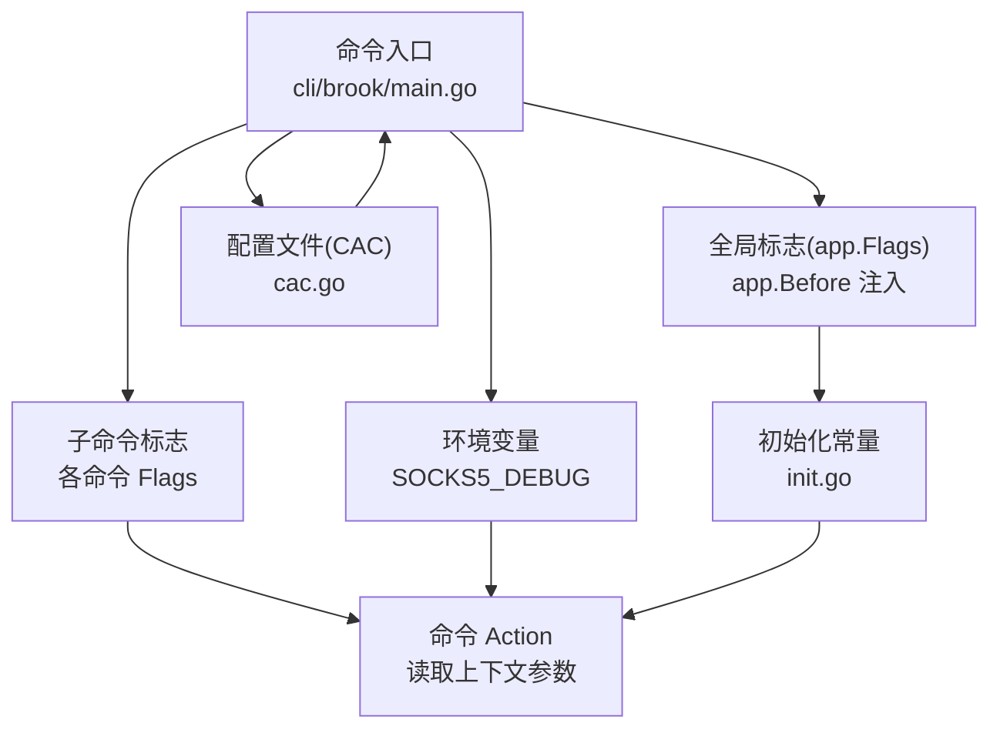
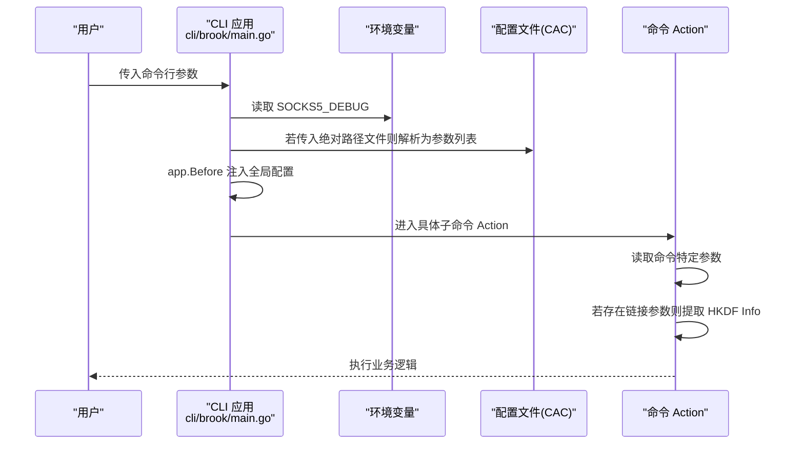
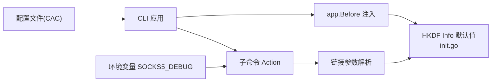

# 配置优先级与继承

<cite>
**本文引用的文件**
- [cli/brook/main.go](file://cli/brook/main.go)
- [init.go](file://init.go)
- [cac.go](file://cac.go)
- [README.md](file://README.md)
</cite>

## 目录
1. [简介](#简介)
2. [项目结构](#项目结构)
3. [核心组件](#核心组件)
4. [架构总览](#架构总览)
5. [详细组件分析](#详细组件分析)
6. [依赖分析](#依赖分析)
7. [性能考虑](#性能考虑)
8. [故障排查指南](#故障排查指南)
9. [结论](#结论)
10. [附录：优先级与继承规则](#附录优先级与继承规则)

## 简介
本文件围绕 brook 工具的配置体系，系统性梳理“命令行参数 > 环境变量 > 默认值”的优先级规则，结合 cli/brook/main.go 的参数解析逻辑与 init.go 的初始化过程，解释全局参数如何被命令特定参数覆盖、配置值的继承机制，并给出可操作的最佳实践与示例路径，帮助用户在不同场景下正确设置配置。

## 项目结构
- 命令入口与参数解析位于 cli/brook/main.go，采用 urfave/cli 框架定义全局标志与各子命令标志，并在 app.Before 中完成全局配置的早期注入。
- 初始化常量位于 init.go，定义 HKDF Info 的默认值。
- 配置文件支持通过环境变量或配置文件进行注入，其中环境变量 SOCKS5_DEBUG 可开启调试模式；配置文件通过 CAC 函数解析为命令行参数列表，从而参与优先级判定。

图表来源
- [cli/brook/main.go](file://cli/brook/main.go#L51-L120)
- [cli/brook/main.go](file://cli/brook/main.go#L164-L295)
- [init.go](file://init.go#L15-L22)
- [cac.go](file://cac.go#L24-L59)

章节来源
- [cli/brook/main.go](file://cli/brook/main.go#L51-L120)
- [cli/brook/main.go](file://cli/brook/main.go#L164-L295)
- [init.go](file://init.go#L15-L22)
- [cac.go](file://cac.go#L24-L59)

## 核心组件
- 全局标志与 app.Before 注入
  - 全局标志定义了日志、pprof、标签、拨号策略（DNS/IP/NIC/SOCKS5）、Prometheus、阻断列表等选项。
  - app.Before 在命令执行前根据全局标志对内部状态进行初始化，如设置 HKDF Info、启用日志、加载拨号插件、启动 pprof/Prometheus 等。
- 子命令 Action
  - 各子命令在 Action 中读取自身标志，必要时从 brook 链接参数中提取配置（例如 clientHKDFInfo/serverHKDFInfo），并据此创建服务实例。
- 环境变量
  - SOCKS5_DEBUG 环境变量用于开启 SOCKS5 调试模式。
- 配置文件
  - 支持传入绝对路径的配置文件，文件内容被解析为命令行参数列表，再交由 CLI 解析器处理，从而参与优先级判定。

章节来源
- [cli/brook/main.go](file://cli/brook/main.go#L66-L163)
- [cli/brook/main.go](file://cli/brook/main.go#L164-L295)
- [cli/brook/main.go](file://cli/brook/main.go#L2911-L2936)
- [cac.go](file://cac.go#L24-L59)

## 架构总览
下面以“全局参数优先于命令特定参数”为主线，展示配置优先级在不同阶段的体现。

图表来源
- [cli/brook/main.go](file://cli/brook/main.go#L164-L295)
- [cli/brook/main.go](file://cli/brook/main.go#L2911-L2936)
- [cac.go](file://cac.go#L24-L59)

## 详细组件分析

### 全局标志与 app.Before 注入
- 全局标志包括日志、pprof、标签、拨号策略、Prometheus、阻断列表等。
- app.Before 在命令执行前完成：
  - 设置 HKDF Info（来自全局标志）
  - 写入 PID 文件
  - 启动 pprof（若指定）
  - 初始化日志（若指定）
  - 加载拨号插件（DNS/IP/NIC/SOCKS5）
  - 启动 Prometheus（若指定）
  - 加载阻断列表（若指定）

这些步骤确保全局配置在任何子命令执行前已生效，为后续命令 Action 提供统一的上下文。

章节来源
- [cli/brook/main.go](file://cli/brook/main.go#L66-L163)
- [cli/brook/main.go](file://cli/brook/main.go#L164-L295)

### 子命令 Action 中的参数读取与继承
- 多个子命令在 Action 中会：
  - 读取自身标志（命令特定参数）
  - 若存在 brook 链接参数，则从链接查询字符串中提取 HKDF Info 并覆盖默认值
  - 根据标志创建对应的服务实例（如服务器、客户端、代理等）
- 这体现了“命令特定参数覆盖全局参数”的优先级原则：当命令特定参数存在时，它会覆盖 app.Before 中由全局标志注入的默认值。

章节来源
- [cli/brook/main.go](file://cli/brook/main.go#L352-L401)
- [cli/brook/main.go](file://cli/brook/main.go#L455-L526)
- [cli/brook/main.go](file://cli/brook/main.go#L596-L646)
- [cli/brook/main.go](file://cli/brook/main.go#L700-L771)
- [cli/brook/main.go](file://cli/brook/main.go#L919-L1042)
- [cli/brook/main.go](file://cli/brook/main.go#L1044-L1183)
- [cli/brook/main.go](file://cli/brook/main.go#L1185-L1290)
- [cli/brook/main.go](file://cli/brook/main.go#L1292-L1397)
- [cli/brook/main.go](file://cli/brook/main.go#L1399-L1539)
- [cli/brook/main.go](file://cli/brook/main.go#L1541-L1687)
- [cli/brook/main.go](file://cli/brook/main.go#L1689-L1794)
- [cli/brook/main.go](file://cli/brook/main.go#L1796-L1852)
- [cli/brook/main.go](file://cli/brook/main.go#L1854-L1937)
- [cli/brook/main.go](file://cli/brook/main.go#L1940-L2010)
- [cli/brook/main.go](file://cli/brook/main.go#L2011-L2138)
- [cli/brook/main.go](file://cli/brook/main.go#L2140-L2214)
- [cli/brook/main.go](file://cli/brook/main.go#L2215-L2288)
- [cli/brook/main.go](file://cli/brook/main.go#L2290-L2372)
- [cli/brook/main.go](file://cli/brook/main.go#L2374-L2433)
- [cli/brook/main.go](file://cli/brook/main.go#L2435-L2495)
- [cli/brook/main.go](file://cli/brook/main.go#L2497-L2625)
- [cli/brook/main.go](file://cli/brook/main.go#L2626-L2704)
- [cli/brook/main.go](file://cli/brook/main.go#L2705-L2740)
- [cli/brook/main.go](file://cli/brook/main.go#L2741-L2831)
- [cli/brook/main.go](file://cli/brook/main.go#L2833-L2870)
- [cli/brook/main.go](file://cli/brook/main.go#L2872-L2910)

### 环境变量与配置文件
- 环境变量
  - SOCKS5_DEBUG：当该环境变量非空时，开启 SOCKS5 调试模式，影响后续相关行为。
- 配置文件
  - 当传入绝对路径的配置文件时，程序会读取该文件并通过 CAC 解析为参数列表，再作为新的 argv 重新交给 CLI 解析器。这使得配置文件中的参数同样遵循“命令行参数 > 环境变量 > 默认值”的优先级规则。

章节来源
- [cli/brook/main.go](file://cli/brook/main.go#L2911-L2936)
- [cac.go](file://cac.go#L24-L59)

### 初始化常量与默认值
- HKDF Info 默认值来源于 init.go，作为全局默认值参与优先级链路。
- 子命令 Action 中若从链接参数提取到 HKDF Info，会覆盖默认值。

章节来源
- [init.go](file://init.go#L15-L22)
- [cli/brook/main.go](file://cli/brook/main.go#L482-L510)
- [cli/brook/main.go](file://cli/brook/main.go#L727-L756)
- [cli/brook/main.go](file://cli/brook/main.go#L1008-L1039)
- [cli/brook/main.go](file://cli/brook/main.go#L1246-L1273)
- [cli/brook/main.go](file://cli/brook/main.go#L1371-L1396)
- [cli/brook/main.go](file://cli/brook/main.go#L1512-L1539)

## 依赖分析
- 组件耦合
  - app.Before 对全局配置的集中注入，使各子命令无需重复初始化，提升内聚性。
  - 子命令 Action 依赖 CLI 上下文参数，命令特定参数对全局参数形成覆盖。
- 外部依赖
  - 环境变量仅影响调试开关（SOCKS5_DEBUG）。
  - 配置文件通过 CAC 解析后参与 CLI 参数解析流程。

图表来源
- [cli/brook/main.go](file://cli/brook/main.go#L164-L295)
- [init.go](file://init.go#L15-L22)
- [cac.go](file://cac.go#L24-L59)

章节来源
- [cli/brook/main.go](file://cli/brook/main.go#L164-L295)
- [init.go](file://init.go#L15-L22)
- [cac.go](file://cac.go#L24-L59)

## 性能考虑
- 全局配置在 app.Before 中一次性注入，避免每个子命令重复初始化，降低启动开销。
- 链接参数解析仅在需要时发生，且只影响 HKDF Info 等少量字段，对整体性能影响有限。
- 环境变量检查为常数时间操作，不会引入额外性能负担。

## 故障排查指南
- 日志与调试
  - 若需调试 SOCKS5 相关问题，设置环境变量 SOCKS5_DEBUG 即可开启调试输出。
- 配置文件路径
  - 传入配置文件时必须为绝对路径；否则会提示路径必须为绝对路径并退出。
- 链接参数覆盖
  - 若命令特定参数未提供，但链接参数包含 HKDF Info，Action 会自动应用链接中的值；若命令特定参数提供了，则以命令特定参数为准。

章节来源
- [cli/brook/main.go](file://cli/brook/main.go#L2911-L2936)
- [cli/brook/main.go](file://cli/brook/main.go#L482-L510)
- [cli/brook/main.go](file://cli/brook/main.go#L727-L756)
- [cli/brook/main.go](file://cli/brook/main.go#L1008-L1039)
- [cli/brook/main.go](file://cli/brook/main.go#L1246-L1273)
- [cli/brook/main.go](file://cli/brook/main.go#L1371-L1396)
- [cli/brook/main.go](file://cli/brook/main.go#L1512-L1539)

## 结论
brook 的配置体系遵循“命令行参数 > 环境变量 > 默认值”的优先级规则。全局标志在 app.Before 中集中注入，随后各子命令 Action 读取命令特定参数并可在必要时覆盖全局默认值（如 HKDF Info）。环境变量仅影响调试开关，配置文件通过 CAC 解析后同样参与优先级判定。理解这一链条有助于在复杂部署场景中正确设置配置，避免冲突与误判。

## 附录：优先级与继承规则
- 优先级顺序
  - 命令行参数（最高优先级）
  - 环境变量
  - 默认值（来自 init.go 或 CLI 标志默认值）
- 全局参数与命令特定参数
  - 全局参数在 app.Before 中注入，为所有子命令提供基础配置。
  - 命令特定参数在子命令 Action 中读取，若存在则覆盖全局参数。
- 链接参数继承
  - 当命令特定参数未提供时，若链接参数包含 HKDF Info，Action 将应用链接中的值。
- 最佳实践
  - 使用命令行参数显式覆盖默认值，确保配置清晰可追溯。
  - 通过配置文件集中管理常用参数，但注意文件路径必须为绝对路径。
  - 仅在需要时使用环境变量（如开启调试），避免污染默认行为。

章节来源
- [cli/brook/main.go](file://cli/brook/main.go#L66-L163)
- [cli/brook/main.go](file://cli/brook/main.go#L164-L295)
- [cli/brook/main.go](file://cli/brook/main.go#L2911-L2936)
- [init.go](file://init.go#L15-L22)
- [cac.go](file://cac.go#L24-L59)