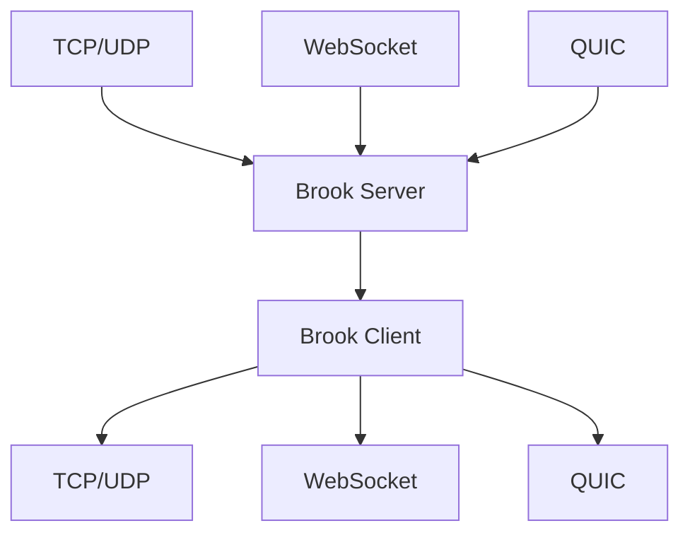
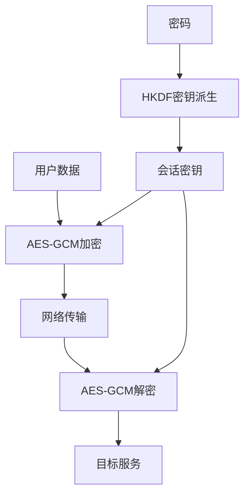
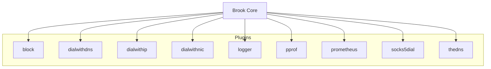
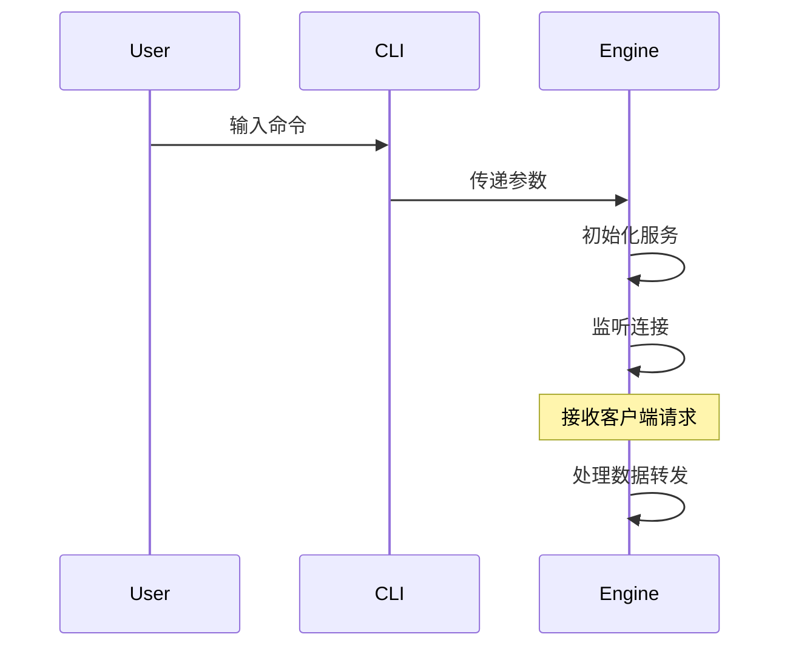

# 项目概述

<cite>
**本文档引用的文件**  
- [README.md](file://README.md)
- [SECURITY.md](file://SECURITY.md)
- [OPENSOURCELICENSES](file://OPENSOURCELICENSES)
- [cli/brook/main.go](file://cli/brook/main.go)
- [server.go](file://server.go)
- [client.go](file://client.go)
- [websocket.go](file://websocket.go)
- [quic.go](file://quic.go)
- [protocol/brook-server-protocol.md](file://protocol/brook-server-protocol.md)
- [protocol/brook-wsserver-protocol.md](file://protocol/brook-wsserver-protocol.md)
- [protocol/brook-quicserver-protocol.md](file://protocol/brook-quicserver-protocol.md)
- [protocol/brook-link-protocol.md](file://protocol/brook-link-protocol.md)
</cite>

## 目录
1. [简介](#简介)
2. [核心价值与定位](#核心价值与定位)
3. [架构设计理念](#架构设计理念)
4. [支持的协议](#支持的协议)
5. [安全机制](#安全机制)
6. [模块化架构](#模块化架构)
7. [主要使用场景](#主要使用场景)
8. [CLI工具与核心引擎交互](#cli工具与核心引擎交互)
9. [简单使用示例](#简单使用示例)
10. [安全策略与许可证信息](#安全策略与许可证信息)

## 简介

brook是一个跨平台的可编程网络工具，旨在为用户提供灵活、安全和高效的网络代理解决方案。该项目支持多种网络协议，包括TCP、UDP、WebSocket和QUIC，并通过AES-GCM加密和HKDF密钥派生等核心安全机制确保通信的安全性。其模块化架构设计使得用户可以根据具体需求进行定制和扩展，适用于网络代理、流量控制和安全通信等多种使用场景。

**Section sources**
- [README.md](file://README.md#L1-L44)

## 核心价值与定位

brook项目的核心价值在于提供一个高度可编程且跨平台的网络代理工具，满足用户在不同环境下的多样化需求。它不仅支持传统的TCP和UDP协议，还扩展到了现代的WebSocket和QUIC协议，从而适应不断变化的网络环境和技术趋势。通过brook，用户可以轻松实现网络流量的转发、过滤和监控，同时利用其强大的安全机制保护数据传输过程中的隐私和完整性。

**Section sources**
- [README.md](file://README.md#L1-L44)

## 架构设计理念

brook的架构设计遵循模块化和可扩展的原则，确保系统的灵活性和可维护性。整个系统由多个独立但相互协作的组件构成，每个组件负责特定的功能，如协议处理、加密解密、日志记录等。这种设计使得开发者可以方便地添加新的功能或修改现有功能，而不会影响到其他部分的正常运行。此外，brook还采用了事件驱动的编程模型，提高了系统的响应速度和资源利用率。

**Section sources**
- [cli/brook/main.go](file://cli/brook/main.go#L1-L800)
- [server.go](file://server.go#L1-L179)
- [client.go](file://client.go#L1-L144)

## 支持的协议

brook支持多种网络协议，以适应不同的应用场景和网络条件。主要支持的协议包括：

- **TCP/UDP**: 传统的传输层协议，广泛应用于各种网络服务中。
- **WebSocket**: 基于HTTP的双向通信协议，适合实时数据交换。
- **QUIC**: 一种基于UDP的低延迟传输协议，旨在减少连接建立时间和提高传输效率。

这些协议的支持使得brook能够在不同的网络环境中提供稳定和高效的代理服务。



**Diagram sources**
- [protocol/brook-server-protocol.md](file://protocol/brook-server-protocol.md#L1-L127)
- [protocol/brook-wsserver-protocol.md](file://protocol/brook-wsserver-protocol.md#L1-L96)
- [protocol/brook-quicserver-protocol.md](file://protocol/brook-quicserver-protocol.md#L1-L25)

## 安全机制

brook采用了一系列先进的安全技术来保障用户的通信安全。其中，AES-GCM加密算法用于对传输的数据进行加密，确保数据在传输过程中不被窃听或篡改。HKDF密钥派生函数则用于生成会话密钥，增强了密钥管理的安全性。此外，brook还支持通过TLS指纹伪装等方式绕过某些网络审查，进一步提升了通信的隐蔽性和安全性。



**Diagram sources**
- [protocol/brook-server-protocol.md](file://protocol/brook-server-protocol.md#L1-L127)
- [websocket.go](file://websocket.go#L1-L200)
- [quic.go](file://quic.go#L1-L174)

## 模块化架构

brook的模块化架构是其灵活性和可扩展性的关键。项目中的各个功能模块，如`plugins/block`、`plugins/dialwithdns`、`plugins/dialwithip`等，都可以独立开发和部署。用户可以根据需要选择启用或禁用特定的插件，从而实现个性化的配置。例如，`block`插件可用于阻止特定域名或IP地址的访问，而`dialwithdns`插件则允许用户指定自定义的DNS服务器进行域名解析。



**Diagram sources**
- [cli/brook/main.go](file://cli/brook/main.go#L1-L800)
- [plugins/block/block.go](file://plugins/block/block.go)
- [plugins/dialwithdns/dialwithdns.go](file://plugins/dialwithdns/dialwithdns.go)
- [plugins/dialwithip/dialwithip.go](file://plugins/dialwithip/dialwithip.go)

## 主要使用场景

brook的主要使用场景包括但不限于：

- **网络代理**: 作为SOCKS5代理服务器，帮助用户访问受限的网络资源。
- **流量控制**: 通过配置规则限制或优先处理特定类型的网络流量。
- **安全通信**: 利用加密和身份验证机制保护敏感数据的传输。

这些功能使得brook成为个人用户和企业组织的理想选择，特别是在需要高度安全和灵活性的网络环境中。

**Section sources**
- [README.md](file://README.md#L1-L44)

## CLI工具与核心引擎交互

brook的CLI工具与核心引擎之间的交互是通过命令行参数和配置文件完成的。用户可以通过CLI命令启动服务器或客户端，并指定监听地址、密码、超时时间等参数。核心引擎根据这些参数初始化相应的服务实例，并开始监听网络连接。当接收到客户端请求时，核心引擎会按照预定义的协议处理流程进行数据转发和处理。



**Diagram sources**
- [cli/brook/main.go](file://cli/brook/main.go#L1-L800)
- [server.go](file://server.go#L1-L179)
- [client.go](file://client.go#L1-L144)

## 简单使用示例

以下是一些brook的简单使用示例，展示了如何启动服务器和客户端：

```bash
# 启动brook服务器
brook server -l :9999 -p hello

# 启动brook客户端
brook client --server 1.2.3.4:9999 --password hello --socks5 127.0.0.1:1080
```

这些命令分别启动了一个监听在9999端口的brook服务器和一个连接到该服务器的客户端，客户端将在本地1080端口开启SOCKS5代理服务。

**Section sources**
- [README.md](file://README.md#L1-L44)

## 安全策略与许可证信息

brook项目非常重视安全性，鼓励用户在发现任何安全漏洞时及时报告。用户可以通过发送电子邮件至cloud@txthinking.com来报告漏洞，建议附带概念验证（POC）代码以便快速修复。所有报告的安全问题都将得到迅速响应和处理。

此外，brook项目遵循GNU General Public License v3.0开源许可证，确保了软件的自由使用、复制、修改和分发。详细的许可证信息可以在项目的OPENSOURCELICENSES文件中找到。

**Section sources**
- [SECURITY.md](file://SECURITY.md#L1-L8)
- [OPENSOURCELICENSES](file://OPENSOURCELICENSES#L1-L800)