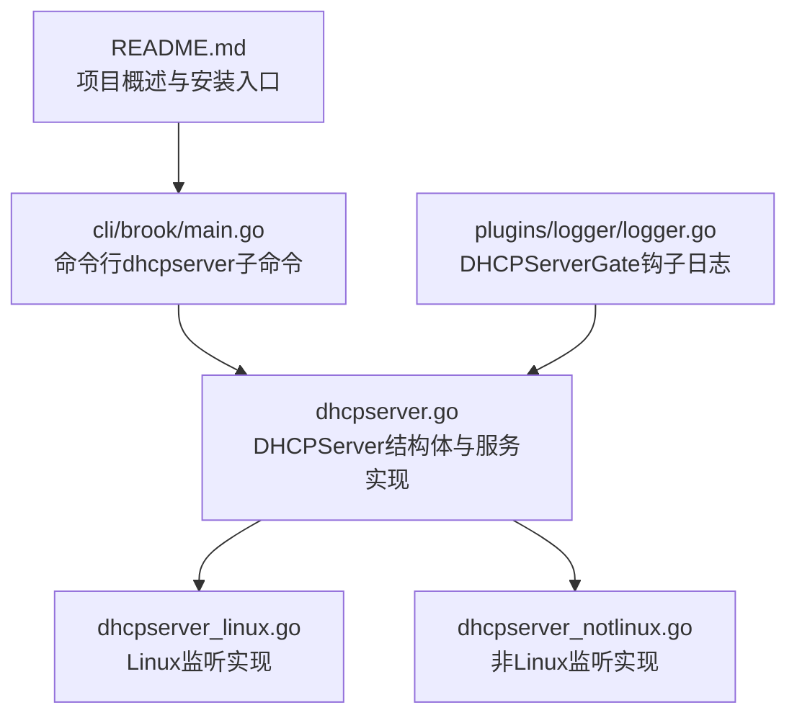
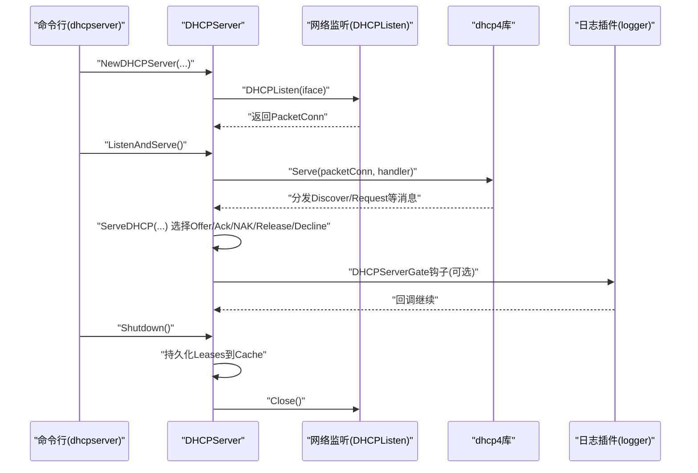
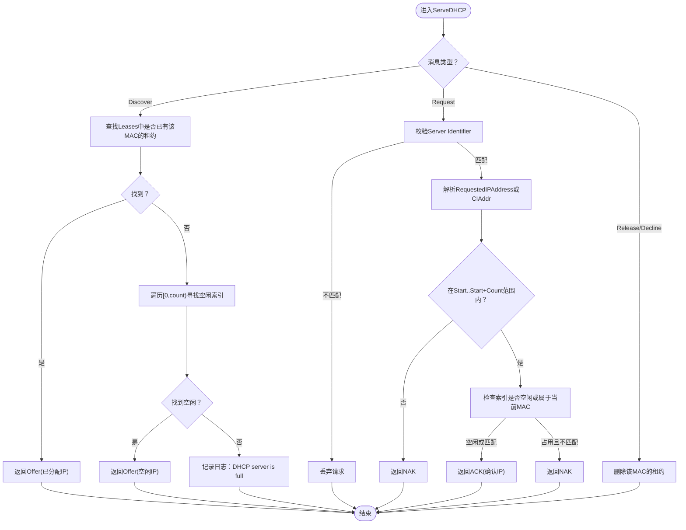
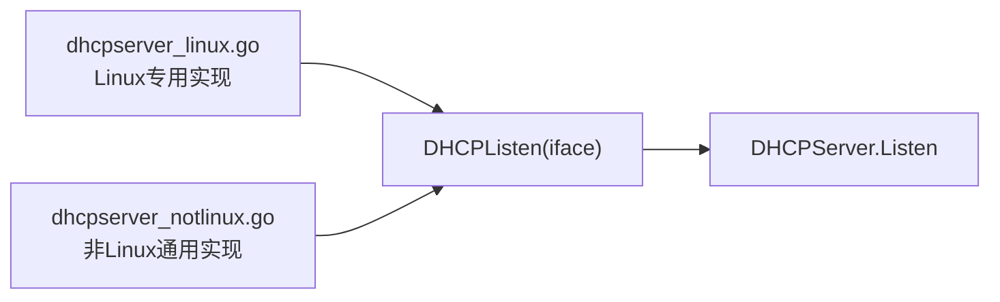
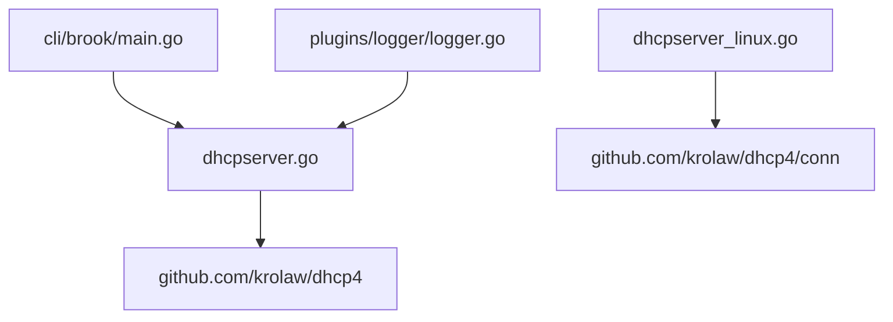

# DHCP服务器

<cite>
**本文引用的文件**
- [dhcpserver.go](file://dhcpserver.go)
- [dhcpserver_linux.go](file://dhcpserver_linux.go)
- [dhcpserver_notlinux.go](file://dhcpserver_notlinux.go)
- [main.go](file://cli/brook/main.go)
- [logger.go](file://plugins/logger/logger.go)
- [README.md](file://README.md)
</cite>

## 目录
1. [简介](#简介)
2. [项目结构](#项目结构)
3. [核心组件](#核心组件)
4. [架构总览](#架构总览)
5. [组件详解](#组件详解)
6. [依赖关系分析](#依赖关系分析)
7. [性能考量](#性能考量)
8. [故障排查指南](#故障排查指南)
9. [结论](#结论)
10. [附录](#附录)

## 简介
本文件围绕 Brook 的 DHCP 服务器实现进行系统化技术文档整理，重点解析 DHCPServer 结构体的设计与实现，涵盖字段作用与配置方式（Listen、ServerIP、Start、Count、Leases、Options、Cache），阐述 DHCP 协议在本地网络中的地址分配机制，并说明如何与 Brook 的代理功能集成。同时提供 Linux 与其他平台的部署示例，结合 dhcpserver_linux.go 与 dhcpserver_notlinux.go 的条件编译策略说明跨平台支持思路；最后给出常见配置错误排查方法与性能优化建议。

## 项目结构
Brook 的 DHCP 服务器由以下关键文件组成：
- dhcpserver.go：DHCPServer 结构体定义、生命周期方法（启动、停止）、DHCP 消息处理逻辑
- dhcpserver_linux.go：Linux 平台专用的 DHCP 监听实现（原生接口绑定）
- dhcpserver_notlinux.go：非 Linux 平台的通用实现（跨平台兼容）
- cli/brook/main.go：命令行子命令“dhcpserver”的参数定义与运行流程
- plugins/logger/logger.go：通过 DHCPServerGate 钩子记录 DHCP 流量日志
- README.md：项目概述与安装入口

图表来源
- [dhcpserver.go](file://dhcpserver.go#L1-L157)
- [dhcpserver_linux.go](file://dhcpserver_linux.go#L1-L29)
- [dhcpserver_notlinux.go](file://dhcpserver_notlinux.go#L1-L26)
- [main.go](file://cli/brook/main.go#L2216-L2288)
- [logger.go](file://plugins/logger/logger.go#L114-L133)
- [README.md](file://README.md#L1-L44)

章节来源
- [dhcpserver.go](file://dhcpserver.go#L1-L157)
- [dhcpserver_linux.go](file://dhcpserver_linux.go#L1-L29)
- [dhcpserver_notlinux.go](file://dhcpserver_notlinux.go#L1-L26)
- [main.go](file://cli/brook/main.go#L2216-L2288)
- [logger.go](file://plugins/logger/logger.go#L114-L133)
- [README.md](file://README.md#L1-L44)

## 核心组件
- DHCPServer 结构体：承载监听套接字、服务器IP、起始IP、租期数量、租约映射、DHCP 选项、缓存路径等核心状态
- NewDHCPServer：负责参数校验、读取缓存、创建监听、初始化 Options
- ListenAndServe/Shutdown：启动服务与优雅停机（持久化租约）
- ServeDHCP：实现 DHCP 四步握手（Discover/Offer/Request/Ack/NAK/Release/Decline）
- DHCPListen：按平台选择监听实现（Linux 使用原生绑定，其他平台回退为通用实现）

章节来源
- [dhcpserver.go](file://dhcpserver.go#L28-L157)
- [dhcpserver_linux.go](file://dhcpserver_linux.go#L23-L28)
- [dhcpserver_notlinux.go](file://dhcpserver_notlinux.go#L23-L25)

## 架构总览
下图展示 DHCP 服务器从命令行启动到服务运行、消息处理与日志记录的整体交互。

图表来源
- [main.go](file://cli/brook/main.go#L2264-L2288)
- [dhcpserver.go](file://dhcpserver.go#L38-L100)
- [dhcpserver_linux.go](file://dhcpserver_linux.go#L23-L28)
- [dhcpserver_notlinux.go](file://dhcpserver_notlinux.go#L23-L25)
- [logger.go](file://plugins/logger/logger.go#L121-L133)

## 组件详解

### DHCPServer 结构体与字段说明
- Listen：底层 UDPv4 监听句柄，用于接收来自客户端的 DHCP 报文
- ServerIP：DHCP 服务器自身的 IP（即本机网卡IP），作为 Option 中的 Server Identifier
- Start：分配起始 IP，通常位于局域网网段内
- Count：可分配的 IP 数量，决定地址池大小
- Leases：租约映射，键为索引（从0开始），值为客户端MAC地址；用于维持固定分配或续租
- Options：DHCP 选项集合，包括子网掩码、路由器（网关）、DNS 等
- Cache：本地缓存文件路径，用于持久化租约映射，重启后恢复

章节来源
- [dhcpserver.go](file://dhcpserver.go#L28-L83)

### 生命周期与配置方法
- NewDHCPServer 参数要点
  - iface：Linux 下可选指定网卡，非 Linux 平台忽略
  - serverip/start/gateway/netmask：均需为合法 IPv4
  - count：地址池大小
  - dnsserver：可多值，均为 IPv4
  - cache：默认使用用户主目录下的 .brook.dhcpserver 文件，若传入需为绝对路径
- ListenAndServe：委托 dhcp4.Serve 启动服务循环
- Shutdown：序列化 Leases 写入 Cache，随后关闭监听

章节来源
- [dhcpserver.go](file://dhcpserver.go#L38-L100)
- [main.go](file://cli/brook/main.go#L2264-L2288)

### DHCP 协议处理逻辑
- Discover：优先检查该客户端是否已有固定租约；否则从可用范围中挑选第一个空闲 IP 返回 Offer
- Request：
  - 若请求的 Server Identifier 与本机不一致则拒绝
  - 若请求的 RequestedIPAddress 在 Start..Start+Count 范围内且未被占用或属于当前 MAC，则 ACK；否则 NAK
- Release/Decline：释放对应 MAC 的租约

图表来源
- [dhcpserver.go](file://dhcpserver.go#L105-L156)

章节来源
- [dhcpserver.go](file://dhcpserver.go#L105-L156)

### 与 Brook 代理功能的集成
- DHCPServerGate：一个可替换的钩子函数，允许在外部注入日志或其他处理逻辑
- logger 插件通过重写 DHCPServerGate，将每次 DHCP 消息的输入/输出、客户端MAC、分配IP、错误等信息统一记录
- 该钩子在每个消息处理分支都会被调用，便于审计与排障

章节来源
- [dhcpserver.go](file://dhcpserver.go#L102-L104)
- [logger.go](file://plugins/logger/logger.go#L121-L133)

### 跨平台支持策略（条件编译）
- Linux 平台：使用原生 UDP4 绑定监听，可绑定到具体网卡，提升权限与稳定性
- 非 Linux 平台：回退为通用 UDP4 监听，不绑定网卡
- 条件编译标签：!linux

图表来源
- [dhcpserver_linux.go](file://dhcpserver_linux.go#L23-L28)
- [dhcpserver_notlinux.go](file://dhcpserver_notlinux.go#L23-L25)

章节来源
- [dhcpserver_linux.go](file://dhcpserver_linux.go#L23-L28)
- [dhcpserver_notlinux.go](file://dhcpserver_notlinux.go#L23-L25)

## 依赖关系分析
- 外部依赖
  - github.com/krolaw/dhcp4：提供 DHCP 协议处理与报文封装
  - github.com/krolaw/dhcp4/conn（Linux）：提供原生 UDP4 绑定能力
- 内部依赖
  - DHCPServer 依赖 dhcp4.Serve 与 dhcp4.Options
  - NewDHCPServer 依赖 DHCPListen（平台相关）
  - logger 插件依赖 DHCPServerGate 钩子

图表来源
- [dhcpserver.go](file://dhcpserver.go#L17-L26)
- [dhcpserver_linux.go](file://dhcpserver_linux.go#L17-L21)
- [main.go](file://cli/brook/main.go#L2264-L2288)
- [logger.go](file://plugins/logger/logger.go#L121-L133)

章节来源
- [dhcpserver.go](file://dhcpserver.go#L17-L26)
- [dhcpserver_linux.go](file://dhcpserver_linux.go#L17-L21)
- [main.go](file://cli/brook/main.go#L2264-L2288)
- [logger.go](file://plugins/logger/logger.go#L121-L133)

## 性能考量
- 地址池规模与内存占用：Leases 映射随 Count 线性增长，建议根据实际接入设备数量合理设置
- 缓存持久化：Leases 写盘仅在 Shutdown 时执行，避免频繁 IO；如需更频繁同步可在业务侧扩展钩子
- 并发模型：dhcp4.Serve 内部处理并发请求，无需额外 goroutine；注意系统 UDP 接收队列与内核参数
- 平台差异：Linux 原生绑定可能减少上下文切换，提高吞吐；非 Linux 平台建议确保防火墙放行 UDP/67
- DNS 与路由：Options 中的 DNS 与网关应与局域网配置一致，避免客户端二次解析失败

[本节为通用指导，不直接分析具体文件]

## 故障排查指南
- 常见配置错误
  - 非法 IPv4 参数：serverip/start/netmask/gateway 或 dnsserver 中任一不是合法 IPv4 将导致初始化失败
  - cache 非绝对路径：命令行要求 cache 必须为绝对路径
  - DHCP server is full：当地址池耗尽时会记录日志并返回空响应
  - 请求的 Server Identifier 不匹配：Request 会被拒绝
- 日志定位
  - 启用 logger 插件后，DHCPServerGate 会记录每次消息的 in/out、client MAC、分配 IP、错误等信息
  - 可通过日志快速定位客户端 MAC、请求类型、分配结果与异常原因
- 平台问题
  - Linux：若需要绑定特定网卡，使用 --interface；否则可能监听到错误接口
  - 非 Linux：无法绑定网卡，确保系统允许 UDP/67 监听
- 网络连通性
  - 确认客户端与服务器在同一广播域内
  - 检查防火墙与安全组是否放行 UDP/67
  - 如有其他 DHCP 服务器，需先停止，避免冲突

章节来源
- [dhcpserver.go](file://dhcpserver.go#L38-L83)
- [main.go](file://cli/brook/main.go#L2264-L2288)
- [logger.go](file://plugins/logger/logger.go#L121-L133)

## 结论
Brook 的 DHCP 服务器以简洁的 DHCPServer 结构为核心，通过 dhcp4 库完成协议处理，并以条件编译实现跨平台监听。其租约持久化、钩子日志与命令行参数设计，使得在本地网络中快速搭建可控的 DHCP 服务成为可能。结合 logger 插件，可对 DHCP 流量进行可观测与审计。部署时需关注平台差异、网络连通性与地址池规模，以获得稳定高效的运行效果。

[本节为总结性内容，不直接分析具体文件]

## 附录

### 命令行部署示例（Linux）
- 选择网卡并启动 DHCP 服务器
  - 示例：brook dhcpserver --interface eth0 --serverip 192.168.1.10 --start 192.168.1.100 --netmask 255.255.255.0 --count 100 --gateway 192.168.1.1 --dnsserver 192.168.1.1
- 无网卡绑定场景
  - 示例：brook dhcpserver --serverip 192.168.1.10 --start 192.168.1.100 --netmask 255.255.255.0 --count 100 --gateway 192.168.1.1 --dnsserver 192.168.1.1

章节来源
- [main.go](file://cli/brook/main.go#L2264-L2288)

### 其他平台部署示例（非 Linux）
- 直接启动（不绑定网卡）
  - 示例：brook dhcpserver --serverip 192.168.1.10 --start 192.168.1.100 --netmask 255.255.255.0 --count 100 --gateway 192.168.1.1 --dnsserver 192.168.1.1
- 注意事项
  - 非 Linux 平台无法绑定网卡，确保系统允许 UDP/67 监听
  - 如存在其他 DHCP 服务器，请先停止

章节来源
- [dhcpserver_notlinux.go](file://dhcpserver_notlinux.go#L23-L25)
- [main.go](file://cli/brook/main.go#L2264-L2288)

### 与 Brook 代理功能集成
- 通过 DHCPServerGate 钩子，可将 DHCP 流量纳入统一日志体系，便于与 Brook 的其他组件（如代理、DNS 等）联动分析
- 可在业务侧扩展钩子逻辑，实现更细粒度的审计与告警

章节来源
- [dhcpserver.go](file://dhcpserver.go#L102-L104)
- [logger.go](file://plugins/logger/logger.go#L121-L133)