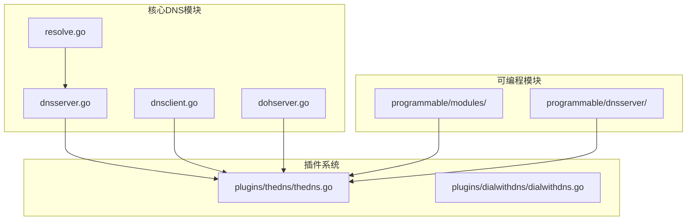
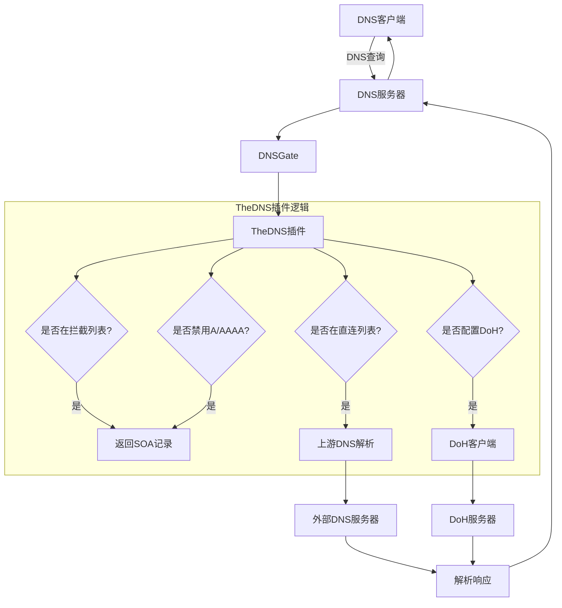
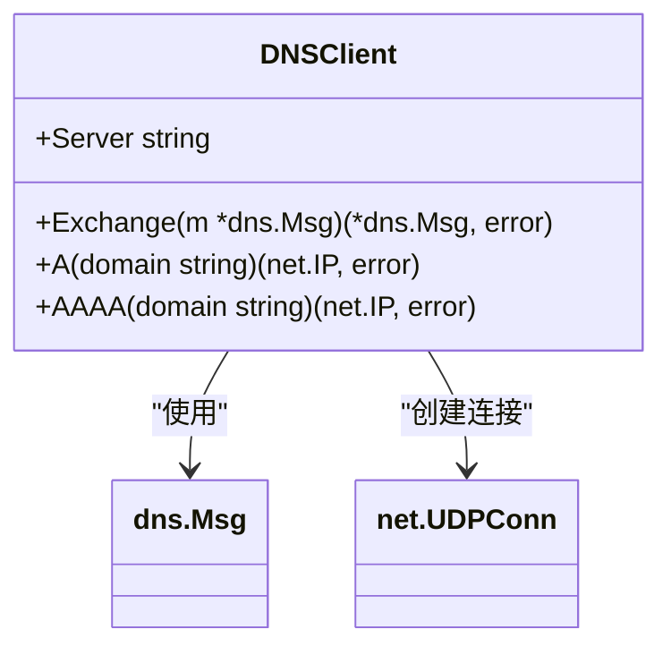
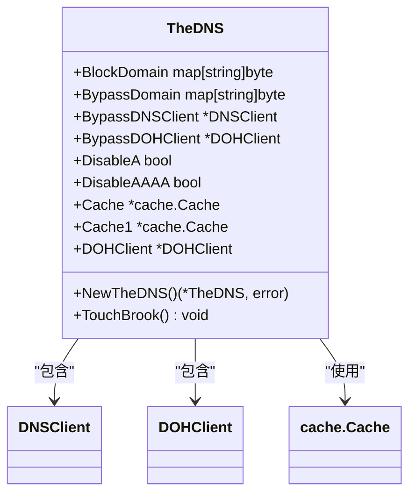
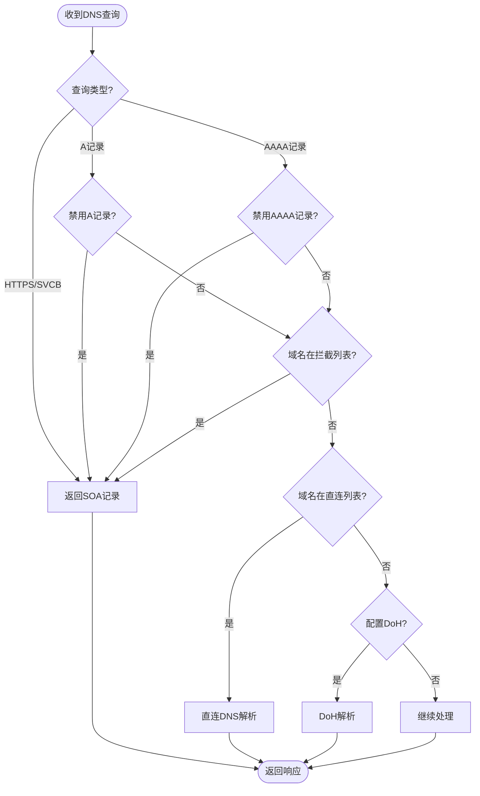
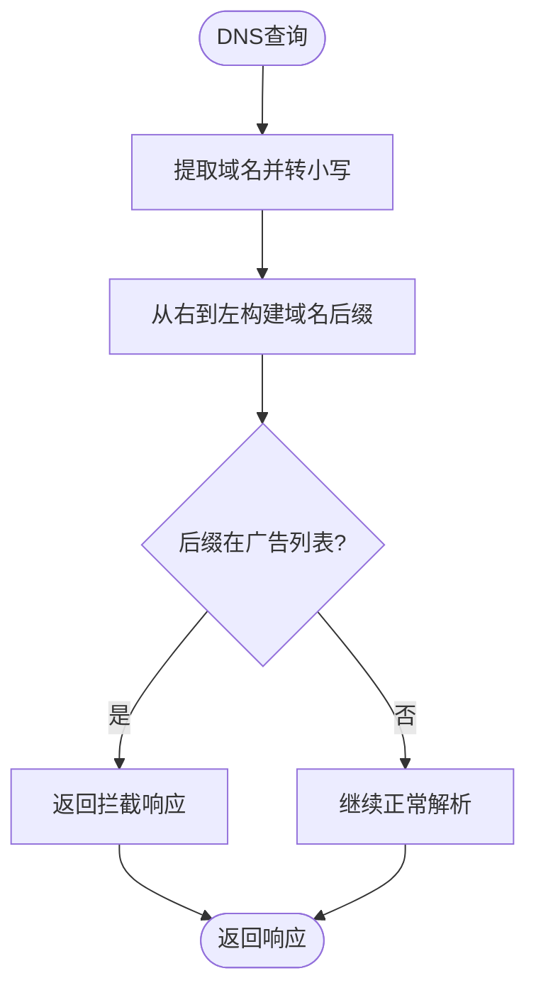
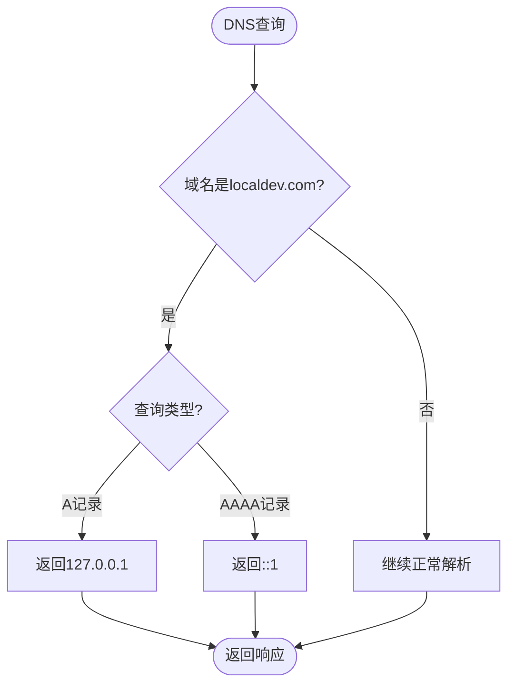
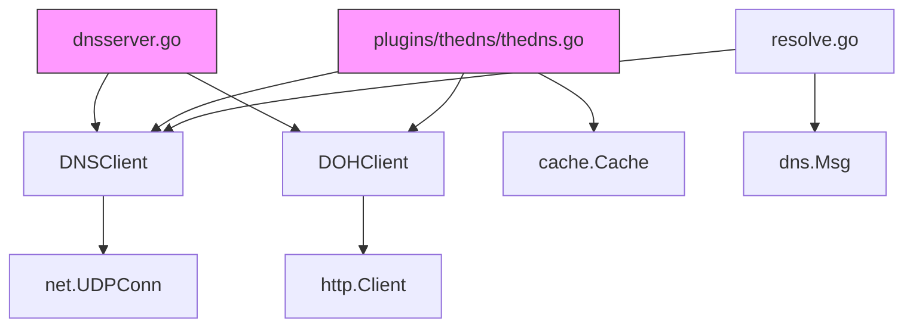

# DNS服务器

<cite>
**本文档中引用的文件**   
- [dnsserver.go](file://dnsserver.go)
- [dnsclient.go](file://dnsclient.go)
- [plugins/thedns/thedns.go](file://plugins/thedns/thedns.go)
- [dohserver.go](file://dohserver.go)
- [resolve.go](file://resolve.go)
- [programmable/modules/block_ad_domain.tengo](file://programmable/modules/block_ad_domain.tengo)
- [programmable/modules/block_a.tengo](file://programmable/modules/block_a.tengo)
- [programmable/modules/block_aaaa.tengo](file://programmable/modules/block_aaaa.tengo)
- [programmable/modules/hosts.tengo](file://programmable/modules/hosts.tengo)
- [programmable/dnsserver/example.tengo](file://programmable/dnsserver/example.tengo)
</cite>

## 目录
1. [简介](#简介)
2. [项目结构](#项目结构)
3. [核心组件](#核心组件)
4. [架构概述](#架构概述)
5. [详细组件分析](#详细组件分析)
6. [依赖分析](#依赖分析)
7. [性能考虑](#性能考虑)
8. [故障排除指南](#故障排除指南)
9. [结论](#结论)

## 简介
本项目实现了一个功能完整的DNS服务器模块，支持权威和递归查询处理。系统基于Go语言开发，利用`github.com/miekg/dns`库处理DNS协议，提供了灵活的可编程控制机制。DNS服务器能够处理标准DNS查询，支持DoH（DNS over HTTPS）协议，并通过插件系统实现广告过滤、域名拦截和内网解析等高级功能。系统设计注重性能和安全性，支持高并发处理，并提供缓存机制优化查询效率。

## 项目结构
项目结构清晰，主要组件分布在不同目录中。核心DNS功能实现在根目录的`dnsserver.go`和`dnsclient.go`文件中，而可编程控制逻辑则通过`plugins/thedns/thedns.go`插件实现。`programmable/modules/`目录包含各种预定义的Tengo脚本模块，用于实现特定的DNS处理策略。

**图源**
- [dnsserver.go](file://dnsserver.go)
- [plugins/thedns/thedns.go](file://plugins/thedns/thedns.go)
- [programmable/modules/](file://programmable/modules/)

**节源**
- [dnsserver.go](file://dnsserver.go)
- [plugins/thedns/thedns.go](file://plugins/thedns/thedns.go)

## 核心组件

DNS服务器模块的核心组件包括：`DNSClient`用于向外部DNS服务器发起查询，`TheDNS`插件提供可编程的DNS处理逻辑，以及`DNSGate`和`DOHGate`函数作为查询处理的入口点。系统通过这些组件协同工作，实现了完整的DNS解析功能。

**节源**
- [dnsserver.go](file://dnsserver.go)
- [dnsclient.go](file://dnsclient.go)
- [plugins/thedns/thedns.go](file://plugins/thedns/thedns.go)

## 架构概述

系统采用插件化架构，核心DNS服务器通过`DNSGate`函数与`TheDNS`插件交互。当收到DNS查询时，请求首先经过`TheDNS`插件的处理逻辑，根据配置决定是拦截、重定向还是转发查询。系统支持多种上游DNS解析方式，包括传统的UDP DNS和现代的DoH协议。

**图源**
- [dnsserver.go](file://dnsserver.go#L24-L49)
- [plugins/thedns/thedns.go](file://plugins/thedns/thedns.go#L134-L208)

## 详细组件分析

### DNS客户端分析
`DNSClient`结构体实现了向外部DNS服务器发起查询的功能。它通过UDP连接发送DNS查询，并处理响应。客户端支持A和AAAA记录查询，为上层组件提供基础的DNS解析能力。

**图源**
- [dnsclient.go](file://dnsclient.go#L24-L87)

**节源**
- [dnsclient.go](file://dnsclient.go#L24-L87)

### TheDNS插件分析
`TheDNS`插件是系统的核心控制组件，提供了丰富的DNS处理功能。它支持域名拦截、直连、A/AAAA记录禁用、缓存和DoH解析等功能，通过可编程方式实现灵活的DNS策略控制。

#### 对象关系图

**图源**
- [plugins/thedns/thedns.go](file://plugins/thedns/thedns.go#L28-L83)

#### 查询处理流程

**图源**
- [plugins/thedns/thedns.go](file://plugins/thedns/thedns.go#L134-L208)

**节源**
- [plugins/thedns/thedns.go](file://plugins/thedns/thedns.go#L28-L210)

### 可编程模块分析
系统通过Tengo脚本语言支持可编程的DNS策略控制。用户可以通过编写简单的脚本实现复杂的DNS处理逻辑，如广告过滤、内网域名解析等。

#### 广告过滤模块

**图源**
- [programmable/modules/block_ad_domain.tengo](file://programmable/modules/block_ad_domain.tengo)

#### 内网域名解析模块

**图源**
- [programmable/modules/hosts.tengo](file://programmable/modules/hosts.tengo)

**节源**
- [programmable/modules/block_ad_domain.tengo](file://programmable/modules/block_ad_domain.tengo)
- [programmable/modules/block_a.tengo](file://programmable/modules/block_a.tengo)
- [programmable/modules/block_aaaa.tengo](file://programmable/modules/block_aaaa.tengo)
- [programmable/modules/hosts.tengo](file://programmable/modules/hosts.tengo)

## 依赖分析

系统依赖关系清晰，核心组件之间耦合度适中。`TheDNS`插件依赖`DNSClient`和`DOHClient`进行外部DNS解析，而`DNSClient`又依赖标准库的网络功能。

**图源**
- [go.mod](file://go.mod)
- [dnsserver.go](file://dnsserver.go)
- [plugins/thedns/thedns.go](file://plugins/thedns/thedns.go)

**节源**
- [go.mod](file://go.mod)
- [dnsserver.go](file://dnsserver.go)
- [plugins/thedns/thedns.go](file://plugins/thedns/thedns.go)

## 性能考虑

系统在设计时考虑了性能优化，通过缓存机制减少重复查询，支持高并发处理，并采用高效的字符串处理算法。`TheDNS`插件使用`patrickmn/go-cache`库实现域名列表的缓存，提高匹配效率。系统能够处理大量并发DNS查询，适合在高负载环境下运行。

## 故障排除指南

常见问题包括DNS查询超时、解析失败和配置错误。建议检查网络连接、上游DNS服务器可达性以及配置文件的正确性。对于性能问题，可以调整缓存策略和超时设置。系统日志提供了详细的运行信息，有助于诊断问题。

**节源**
- [error.go](file://error.go)
- [log.go](file://log.go)

## 结论

本DNS服务器模块提供了一个功能强大且灵活的DNS解决方案。通过插件化架构和可编程控制，用户可以轻松实现各种DNS策略，从简单的内网解析到复杂的广告过滤。系统设计合理，性能优良，适合各种网络环境下的DNS服务需求。