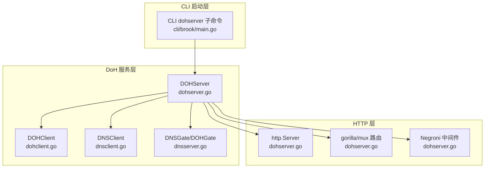
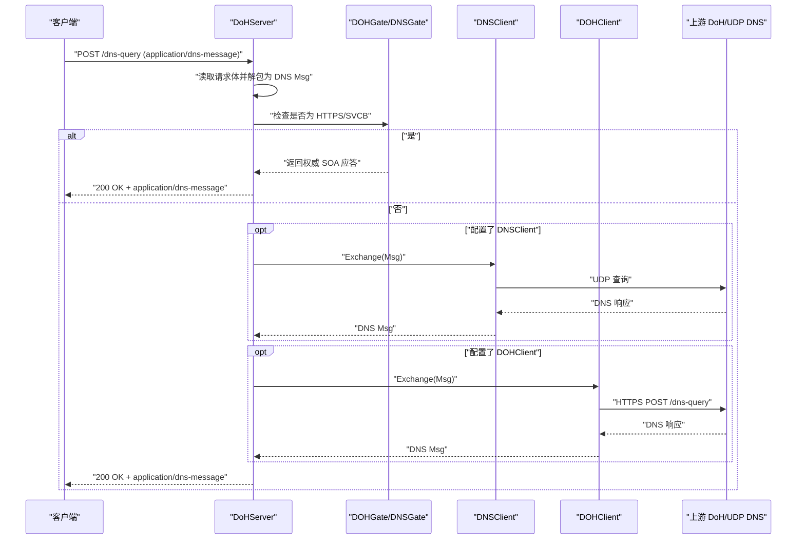
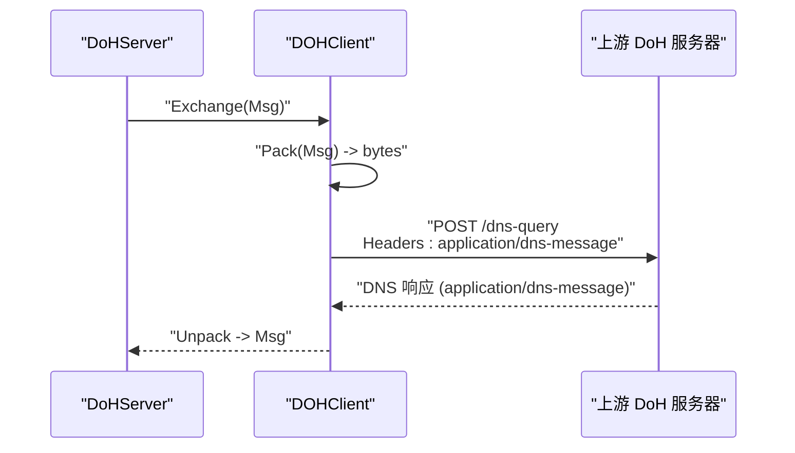
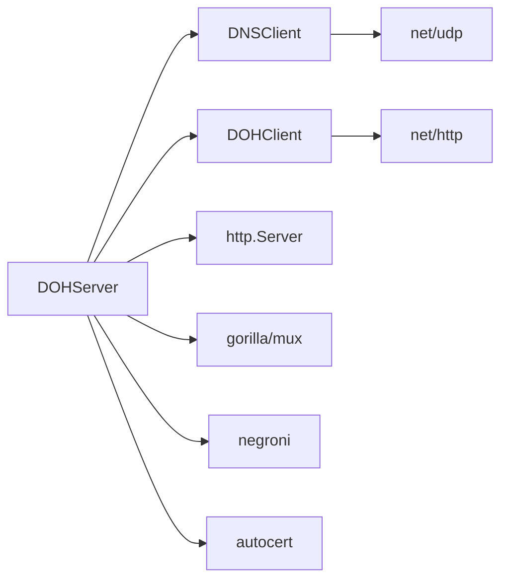

# DOH服务器

<cite>
**本文引用的文件**
- [dohserver.go](file://dohserver.go)
- [dohclient.go](file://dohclient.go)
- [dnsserver.go](file://dnsserver.go)
- [dnsclient.go](file://dnsclient.go)
- [server.go](file://server.go)
- [cli/brook/main.go](file://cli/brook/main.go)
- [README.md](file://README.md)
- [pac.go](file://pac.go)
- [websocket.go](file://websocket.go)
</cite>

## 目录
1. [简介](#简介)
2. [项目结构](#项目结构)
3. [核心组件](#核心组件)
4. [架构总览](#架构总览)
5. [详细组件分析](#详细组件分析)
6. [依赖关系分析](#依赖关系分析)
7. [性能考量](#性能考量)
8. [故障排查指南](#故障排查指南)
9. [结论](#结论)
10. [附录](#附录)

## 简介
本文件围绕 Brook 项目中的 DNS over HTTPS（DoH）服务器实现进行深入技术解析，重点聚焦于 DOHServer 结构体的 Addr、Domain、Path、DNSClient、DOHClient 和 HTTPServer 等字段的配置与作用；解释如何通过 HTTPS 加密传输 DNS 查询以保障用户隐私；说明与 dohclient.go 的协议交互，以及与 dnsserver.go 的后端集成方式；提供 TLS 证书配置（Cert 和 CertKey）的最佳实践；展示安全的 DoH 服务部署方案；并包含跨平台兼容性、性能瓶颈分析与与主流浏览器的兼容性测试要点。

## 项目结构
DoH 服务器相关代码主要分布在以下文件：
- dohserver.go：定义并实现 DoH 服务器核心逻辑，包括路由、TLS、证书自动签发、请求处理与转发。
- dohclient.go：实现 DoH 客户端，负责向上游 DoH 服务器发送 POST 请求并解析响应。
- dnsserver.go：提供 DNS 基础网关，用于处理 HTTPS/SVCB 类型查询的特殊应答。
- dnsclient.go：实现基于 UDP 的 DNS 客户端，用于向传统 DNS 服务器发起查询。
- server.go：通用服务框架（非 DoH），用于理解整体服务启动与关闭流程。
- cli/brook/main.go：命令行入口，包含 dohserver 子命令及参数解析、证书加载与启动流程。
- pac.go：PAC 服务（与 DoH 无直接耦合，但体现 HTTP 服务模式）。
- websocket.go：WebSocket 相关实现（与 DoH 无直接耦合，但体现 TLS/ALPN 处理思路）。

图表来源
- [dohserver.go](file://dohserver.go#L65-L133)
- [dohclient.go](file://dohclient.go#L28-L83)
- [dnsclient.go](file://dnsclient.go#L24-L54)
- [dnsserver.go](file://dnsserver.go#L24-L49)
- [cli/brook/main.go](file://cli/brook/main.go#L2011-L2138)

章节来源
- [dohserver.go](file://dohserver.go#L32-L133)
- [cli/brook/main.go](file://cli/brook/main.go#L2011-L2138)

## 核心组件
- DOHServer：封装 DoH 服务器的监听地址、域名、路径、后端 DNS 客户端、上游 DoH 客户端、HTTP 服务器实例以及 TLS 证书配置。
- DOHClient：封装 DoH 客户端，负责构造 POST 请求、设置 Content-Type/Accept 头、发送并解析 DNS 消息。
- DNSClient：封装基于 UDP 的 DNS 客户端，负责向传统 DNS 服务器发起查询。
- DNSGate/DOHGate：对 HTTPS/SVCB 类型查询返回权威 SOA 记录，作为 DoH 特殊处理。
- HTTPServer：基于 net/http 的 HTTP/HTTPS 服务器，承载 DoH 路由与中间件。

章节来源
- [dohserver.go](file://dohserver.go#L32-L63)
- [dohclient.go](file://dohclient.go#L28-L83)
- [dnsclient.go](file://dnsclient.go#L24-L54)
- [dnsserver.go](file://dnsserver.go#L24-L49)

## 架构总览
DoH 服务器在启动时根据是否指定域名决定运行 HTTP 或 HTTPS；若提供域名，则启用 TLS 并支持自动证书签发或手动证书加载；路由仅接受 POST 到指定 Path；请求进入后先尝试特殊类型查询处理，再根据配置选择 DNSClient 或 DOHClient 进行转发，最后将响应打包为 application/dns-message 返回。

图表来源
- [dohserver.go](file://dohserver.go#L135-L198)
- [dohclient.go](file://dohclient.go#L58-L83)
- [dnsclient.go](file://dnsclient.go#L28-L54)
- [dnsserver.go](file://dnsserver.go#L24-L49)

## 详细组件分析

### DOHServer 字段与配置
- Addr：监听地址，如 ":443" 或 ":80"。当 Domain 为空时运行 HTTP；否则运行 HTTPS。
- Domain：域名，用于 TLS 证书绑定与自动签发。
- Path：DoH 路径，默认 "/dns-query"。
- DNSClient：当 to 参数不是 https:// 开头时创建，用于向传统 DNS 服务器发起查询。
- DOHClient：当 to 参数是 https:// 开头时创建，用于向上游 DoH 服务器发起查询。
- HTTPServer：承载路由与中间件的 HTTP 服务器实例。
- Cert/CertKey：手动提供的证书与私钥字节，优先级高于自动签发。

关键流程与实现位置
- NewDOHServer：根据 to 参数选择 DNSClient 或 DOHClient。
- ListenAndServe：配置路由、中间件、TLS（自动签发或手动证书）、启动监听。
- ServeHTTP：读取请求体、解包 DNS Msg、调用 DOHGate、按配置转发、打包响应。
- Shutdown：优雅关闭 HTTP 服务器。

章节来源
- [dohserver.go](file://dohserver.go#L43-L63)
- [dohserver.go](file://dohserver.go#L65-L133)
- [dohserver.go](file://dohserver.go#L135-L198)
- [dohserver.go](file://dohserver.go#L200-L203)

### TLS 证书配置与最佳实践
- 自动签发：当 Domain 非空且未提供 Cert/CertKey 时，使用 autocert 管理器自动签发证书；同时在 80 端口开启 HTTP-01 验证处理器。
- 手动证书：通过 CLI 子命令加载证书与私钥字节，设置 TLSConfig 并启动 HTTPS。
- 最佳实践建议：
  - 使用强密码套件与现代 TLS 版本。
  - 为 DoH 专用域名配置 A/AAAA 记录并开放 80 端口以便 ACME 验证。
  - 将证书与私钥放置在受控目录，避免权限泄露。
  - 在反向代理后部署时，确保正确传递 Host 与 ALPN 设置。

章节来源
- [dohserver.go](file://dohserver.go#L92-L133)
- [cli/brook/main.go](file://cli/brook/main.go#L2020-L2046)
- [cli/brook/main.go](file://cli/brook/main.go#L2115-L2128)

### 与 dohclient.go 的协议交互
- DOHClient.Exchange：将 DNS Msg 打包为二进制，构造 POST 请求，设置 Accept 与 Content-Type 为 application/dns-message，发送到上游 DoH 地址并解析响应。
- NewDOHClient：从 URL 解析出 address 查询参数，将其作为 TCP 出站地址，其余查询参数保留用于 DoH 地址本身。
- A/AAAA 辅助方法：分别发起 TypeA/TypeAAAA 查询并提取 IP。

图表来源
- [dohclient.go](file://dohclient.go#L58-L83)
- [dohclient.go](file://dohclient.go#L33-L56)

章节来源
- [dohclient.go](file://dohclient.go#L28-L83)

### 与 dnsserver.go 的后端集成方式
- DNSGate/DOHGate：当查询类型为 HTTPS 或 SVCB 时，返回权威 SOA 记录，作为 DoH 特殊处理的一部分。
- DoHServer.ServeHTTP：在常规查询路径中，先尝试 DOHGate，若未命中则根据配置选择 DNSClient 或 DOHClient 进行转发。

章节来源
- [dnsserver.go](file://dnsserver.go#L24-L49)
- [dohserver.go](file://dohserver.go#L135-L198)

### 与 DNSClient 的集成
- DNSClient.Exchange：通过 UDP 发送 DNS 请求，设置超时，读取响应并解包。
- A/AAAA 辅助方法：分别发起 TypeA/TypeAAAA 查询并提取 IP。

章节来源
- [dnsclient.go](file://dnsclient.go#L24-L54)
- [dnsclient.go](file://dnsclient.go#L56-L87)

### CLI 启动与参数
- dohserver 子命令支持：
  - --listen：监听地址
  - --domainaddress：域名:端口，用于 HTTPS 与自动签发
  - --cert/--certkey：证书与私钥绝对路径
  - --path：DoH 路径，默认 "/dns-query"
  - --dns：上游 DNS 地址（UDP 或 DoH）
  - --disableA/--disableAAAA：禁用 A/AAAA 查询
  - --tcpTimeout/--udpTimeout：超时设置
- 启动流程：解析参数 -> 创建 DOHServer -> 加载证书 -> 启动监听 -> 优雅关闭

章节来源
- [cli/brook/main.go](file://cli/brook/main.go#L2011-L2138)

## 依赖关系分析
- 组件耦合：
  - DOHServer 依赖 DNSClient/DOHClient 作为后端查询通道。
  - DOHServer 依赖 gorilla/mux 提供路由，urfave/negroni 提供中间件。
  - TLS 依赖 golang.org/x/crypto/acme/autocert 实现自动签发。
- 外部依赖：
  - github.com/miekg/dns：DNS 协议编解码。
  - github.com/gorilla/mux、github.com/urfave/negroni：HTTP 路由与中间件。
  - golang.org/x/crypto/acme/autocert：自动证书签发。
- 潜在循环依赖：当前文件未见循环导入。

图表来源
- [dohserver.go](file://dohserver.go#L65-L133)
- [dohclient.go](file://dohclient.go#L28-L83)
- [dnsclient.go](file://dnsclient.go#L24-L54)

章节来源
- [dohserver.go](file://dohserver.go#L65-L133)
- [dohclient.go](file://dohclient.go#L28-L83)
- [dnsclient.go](file://dnsclient.go#L24-L54)

## 性能考量
- 路由与中间件：
  - 使用 gorilla/mux 与 negroni，具备良好的路由与中间件生态，适合 DoH 的简单请求处理。
- TLS 性能：
  - 自动签发涉及 ACME 验证，首次启动可能有额外开销；建议生产环境使用预热与缓存策略。
  - 手动证书可减少首次握手成本。
- 上游转发：
  - DNSClient 使用 UDP，延迟低但无可靠性保证；DOHClient 使用 HTTP/HTTPS，可靠性更高但有额外握手与协议开销。
- 超时与资源：
  - HTTP 服务器设置了 ReadTimeout/WriteTimeout/IdleTimeout，有助于防止资源耗尽。
  - DNSClient 设置了读取超时，避免阻塞。
- 并发与连接：
  - DoHServer 未显式设置连接池或并发上限，建议结合反向代理或负载均衡器进行横向扩展。

章节来源
- [dohserver.go](file://dohserver.go#L81-L123)
- [dnsclient.go](file://dnsclient.go#L28-L54)

## 故障排查指南
- 证书问题：
  - 若使用自动签发，确认域名已解析到服务器 IP，且 80 端口可访问；检查 autocert 缓存目录权限。
  - 若使用手动证书，确认 Cert/CertKey 路径为绝对路径且文件存在。
- 路由与路径：
  - 确认 Path 与上游 DoH 一致；浏览器或客户端需使用相同路径。
- 上游 DoH/UDP：
  - 当配置为 DoH 时，确保 address 查询参数正确；当配置为 UDP 时，确认 DNS 服务器可达。
- 常见错误：
  - 解包失败：检查请求体是否为合法 DNS 消息。
  - 超时：适当增大 tcpTimeout/udpTimeout 或优化网络路径。
  - HTTPS 握手失败：检查证书链、SNI 与 ALPN 设置。

章节来源
- [dohserver.go](file://dohserver.go#L135-L198)
- [dohserver.go](file://dohserver.go#L92-L133)
- [cli/brook/main.go](file://cli/brook/main.go#L2082-L2090)

## 结论
DoHServer 通过 HTTPS 对 DNS 查询进行加密传输，结合 DNSClient/DOHClient 提供灵活的后端选择；配合自动/手动证书机制，可在多平台上安全部署。其架构简洁、易于扩展，适合在反向代理或负载均衡器之后部署，以获得更好的可用性与性能表现。建议在生产环境中采用手动证书与预热策略，合理设置超时与并发，确保稳定与安全。

## 附录

### 部署与运维建议
- 域名与证书：
  - 使用独立域名部署 DoH，提前完成 A/AAAA 记录与 80 端口开放。
  - 生产环境优先使用手动证书，避免首次签发开销。
- 反向代理：
  - 建议在 Nginx/Traefik 等反向代理后部署，统一处理 TLS 与压缩。
- 监控与日志：
  - 结合日志插件记录 DoH 请求类型与域名，便于审计与排障。
- 兼容性测试：
  - 使用主流浏览器（Chrome/Firefox/Edge/Safari）与 DoH 客户端进行连通性与性能测试。
  - 验证 HTTPS/SVCB 类型查询的权威应答行为。

章节来源
- [cli/brook/main.go](file://cli/brook/main.go#L2011-L2138)
- [README.md](file://README.md#L1-L44)