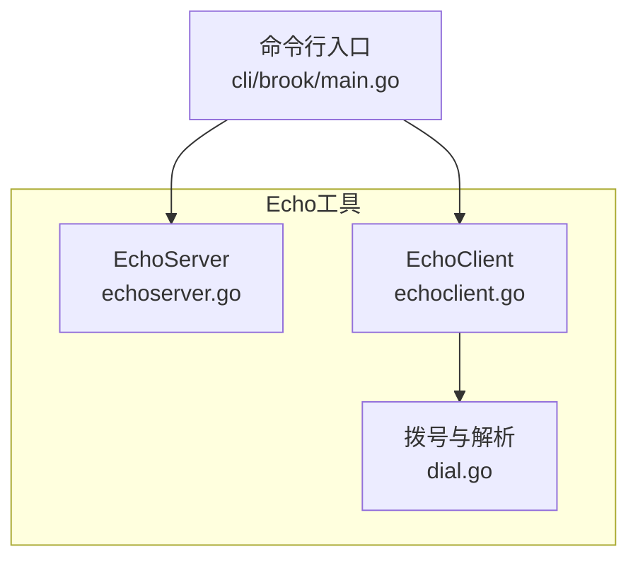
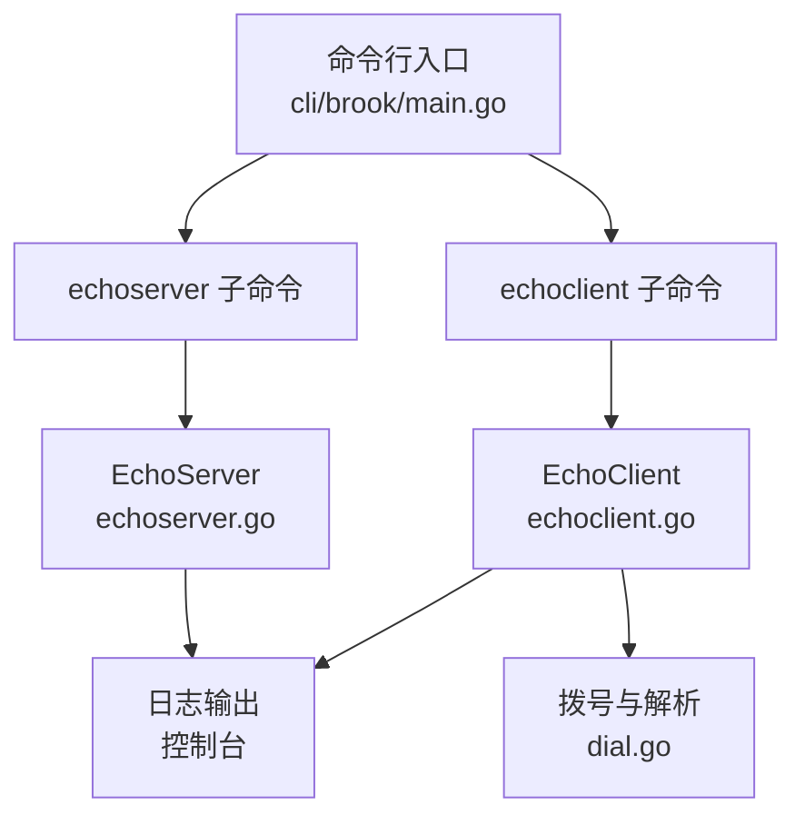
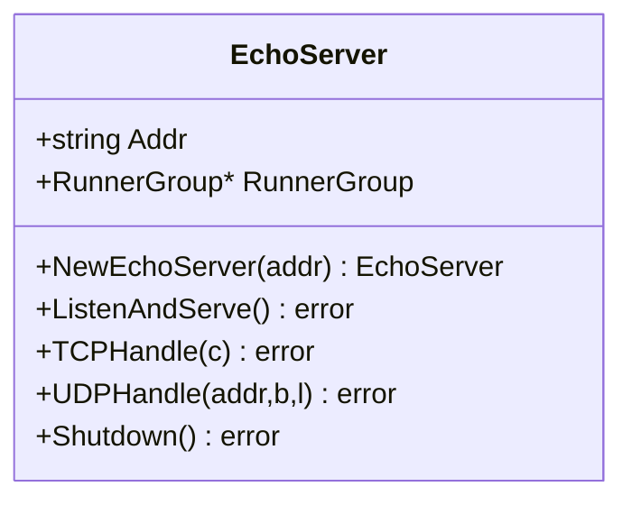
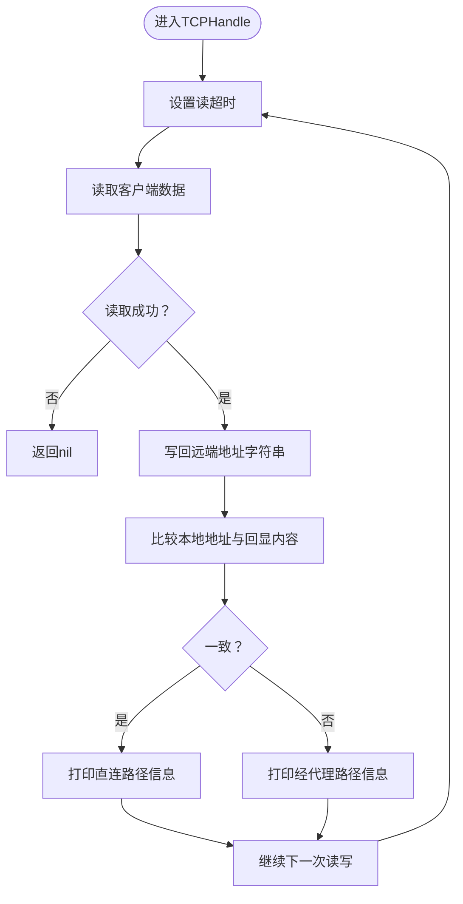
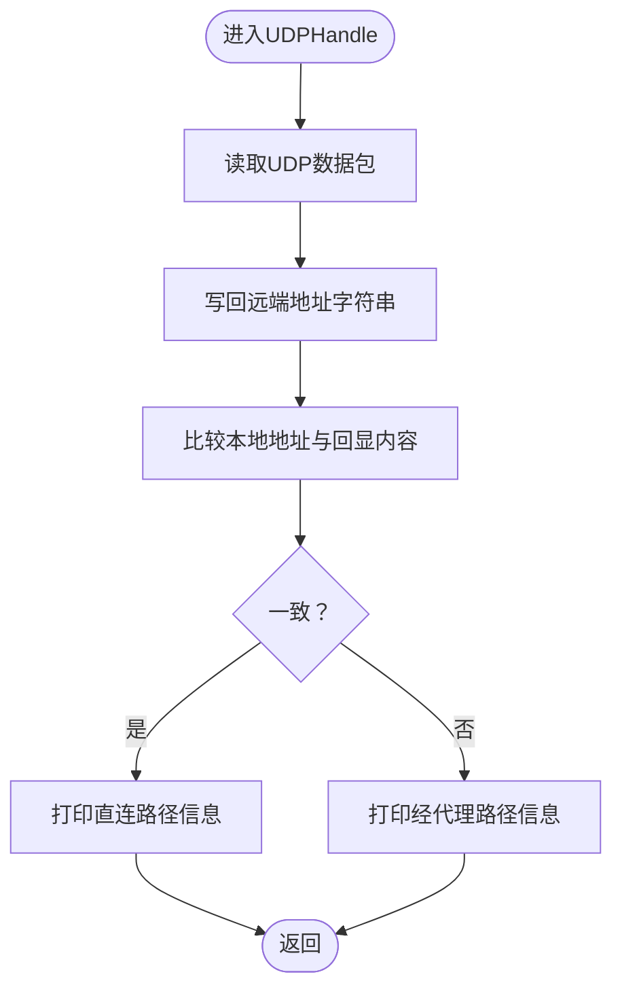
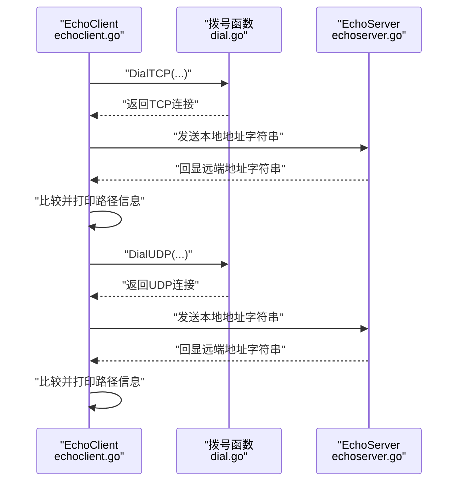
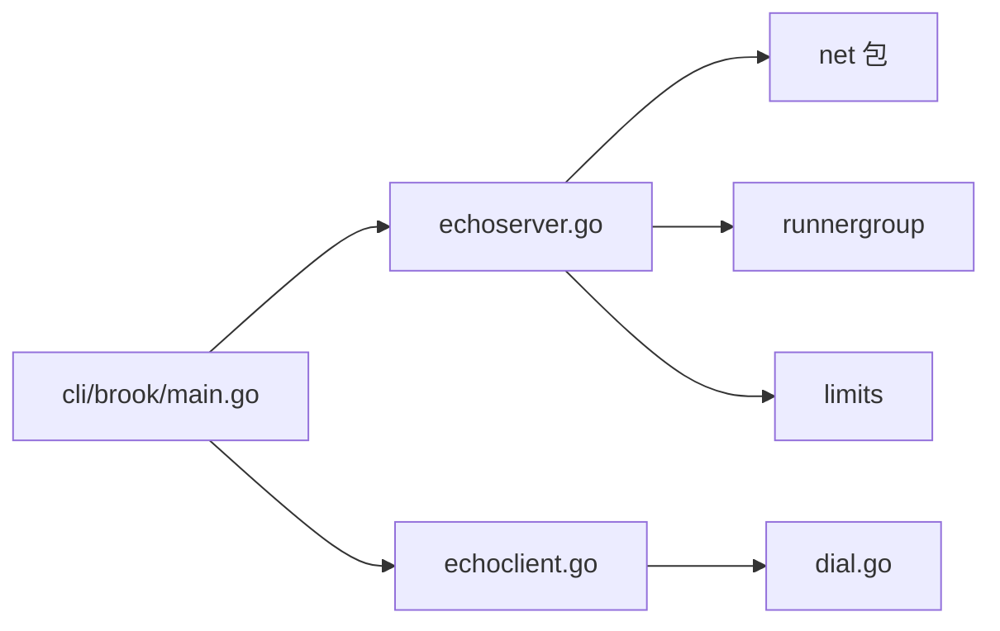

# Echo工具

<cite>
**本文引用的文件列表**
- [echoserver.go](file://echoserver.go)
- [echoclient.go](file://echoclient.go)
- [cli/brook/main.go](file://cli/brook/main.go)
- [dial.go](file://dial.go)
- [README.md](file://README.md)
</cite>

## 目录
1. [简介](#简介)
2. [项目结构](#项目结构)
3. [核心组件](#核心组件)
4. [架构总览](#架构总览)
5. [详细组件分析](#详细组件分析)
6. [依赖关系分析](#依赖关系分析)
7. [性能与并发特性](#性能与并发特性)
8. [命令行使用指南](#命令行使用指南)
9. [高精度时间测量方法](#高精度时间测量方法)
10. [故障排查与实战技巧](#故障排查与实战技巧)
11. [结论](#结论)

## 简介
本技术文档围绕Echo工具展开，系统阐述EchoServer结构体中Addr与RunnerGroup字段的作用，并基于echoserver.go与echoclient.go实现端到端的网络连通性测试流程。文档还说明该工具在诊断代理链路延迟、验证网络可达性方面的典型应用场景，提供命令行使用示例、高精度时间测量方法、多连接并发测试能力说明，以及在复杂网络拓扑中的故障排查实用技巧。

## 项目结构
Echo工具位于仓库根目录，由以下关键文件组成：
- echoserver.go：Echo服务端实现，支持TCP/UDP回显，打印路由路径信息
- echoclient.go：Echo客户端实现，向Echo服务端发起多次往返交互
- cli/brook/main.go：命令行入口，注册echoserver与echoclient子命令
- dial.go：封装TCP/UDP拨号与解析函数，供Echo客户端使用
- README.md：项目概述与基础用法指引

图表来源
- [echoserver.go](file://echoserver.go#L26-L148)
- [echoclient.go](file://echoclient.go#L1-L70)
- [cli/brook/main.go](file://cli/brook/main.go#L2626-L2704)
- [dial.go](file://dial.go#L1-L63)

章节来源
- [README.md](file://README.md#L1-L44)

## 核心组件
- EchoServer结构体
  - Addr：监听地址字符串，用于TCP/UDP监听
  - RunnerGroup：运行组管理器，负责服务生命周期（启动/停止/等待）
- EchoClient函数
  - 通过TCP/UDP连接Echo服务端，发送自身本地地址作为“回显内容”，接收服务端回传的地址字符串，据此判断是否经过代理及代理方向
  - 支持指定交互次数，便于统计往返时延与成功率

章节来源
- [echoserver.go](file://echoserver.go#L26-L40)
- [echoclient.go](file://echoclient.go#L21-L69)

## 架构总览
Echo工具采用“命令行驱动 + 服务端/客户端模块”的分层设计：
- 命令行层：注册echoserver与echoclient两个子命令，解析参数并创建对应实例
- 服务端层：EchoServer负责同时监听TCP与UDP端口，分别处理请求并回显地址信息
- 客户端层：EchoClient通过拨号函数建立连接，按指定次数进行往返交互，输出路由路径信息

图表来源
- [cli/brook/main.go](file://cli/brook/main.go#L2626-L2704)
- [echoserver.go](file://echoserver.go#L41-L103)
- [echoclient.go](file://echoclient.go#L21-L69)
- [dial.go](file://dial.go#L21-L60)

## 详细组件分析

### EchoServer结构体与生命周期
- 字段说明
  - Addr：监听地址，如":9999"
  - RunnerGroup：运行组，用于统一管理多个Runner（监听TCP/UDP），支持优雅关闭与等待退出
- 生命周期管理
  - NewEchoServer：初始化RunnerGroup并尝试提升系统资源限制
  - ListenAndServe：同时启动TCP与UDP监听；每个监听以独立Runner加入RunnerGroup；Wait阻塞直到收到停止信号或错误
  - Shutdown：调用RunnerGroup.Done触发所有Runner停止

图表来源
- [echoserver.go](file://echoserver.go#L26-L40)
- [echoserver.go](file://echoserver.go#L41-L103)
- [echoserver.go](file://echoserver.go#L105-L143)
- [echoserver.go](file://echoserver.go#L145-L148)

章节来源
- [echoserver.go](file://echoserver.go#L26-L40)
- [echoserver.go](file://echoserver.go#L41-L103)
- [echoserver.go](file://echoserver.go#L105-L143)
- [echoserver.go](file://echoserver.go#L145-L148)

### TCP处理逻辑（EchoServer.TCPHandle）
- 循环读取客户端数据，设置读超时，写回客户端远端地址字符串
- 将客户端本地地址与回显内容对比，打印“直连”或“经代理”的路径信息
- 通过持续循环处理单连接，直至读取失败或超时

图表来源
- [echoserver.go](file://echoserver.go#L105-L128)

章节来源
- [echoserver.go](file://echoserver.go#L105-L128)

### UDP处理逻辑（EchoServer.UDPHandle）
- 读取客户端数据包，写回客户端远端地址字符串
- 同样根据本地地址与回显内容一致性，打印“直连”或“经代理”的路径信息

图表来源
- [echoserver.go](file://echoserver.go#L130-L143)

章节来源
- [echoserver.go](file://echoserver.go#L130-L143)

### EchoClient函数与拨号机制
- TCP路径：通过拨号函数建立TCP连接，发送自身本地地址字符串，接收回显并打印路径信息
- UDP路径：通过拨号函数建立UDP连接，发送自身本地地址字符串，接收回显并打印路径信息
- times参数：控制往返交互次数，便于统计时延与成功率

图表来源
- [echoclient.go](file://echoclient.go#L21-L69)
- [dial.go](file://dial.go#L28-L60)
- [echoserver.go](file://echoserver.go#L105-L143)

章节来源
- [echoclient.go](file://echoclient.go#L21-L69)
- [dial.go](file://dial.go#L21-L60)

## 依赖关系分析
- 命令行入口对Echo子命令的依赖
  - echoserver子命令：创建EchoServer实例，加入RunnerGroup并等待
  - echoclient子命令：调用EchoClient函数执行往返测试
- EchoServer内部依赖
  - net包：TCP/UDP监听与连接处理
  - runnergroup：统一管理监听任务的启动/停止/等待
  - limits：尝试提升系统资源限制
- EchoClient依赖
  - dial.go中的DialTCP/DialUDP：封装TCP/UDP拨号与解析

图表来源
- [cli/brook/main.go](file://cli/brook/main.go#L2626-L2704)
- [echoserver.go](file://echoserver.go#L17-L24)
- [echoclient.go](file://echoclient.go#L17-L20)
- [dial.go](file://dial.go#L17-L20)

章节来源
- [cli/brook/main.go](file://cli/brook/main.go#L2626-L2704)
- [echoserver.go](file://echoserver.go#L17-L24)
- [echoclient.go](file://echoclient.go#L17-L20)
- [dial.go](file://dial.go#L17-L20)

## 性能与并发特性
- 并发模型
  - EchoServer对每个TCP连接采用goroutine处理，避免阻塞Accept循环
  - UDP监听以独立Runner运行，持续ReadFromUDP并异步处理
- 资源限制
  - 启动时尝试提升系统资源限制，有助于在高并发场景下维持稳定
- 超时控制
  - TCP侧设置读超时，防止长时间占用连接
- 并发测试能力
  - EchoClient通过times参数可重复发起往返，便于统计时延与成功率；若需更高并发，可在外部以多进程或多线程方式并行调用EchoClient

章节来源
- [echoserver.go](file://echoserver.go#L41-L103)
- [echoserver.go](file://echoserver.go#L105-L128)
- [echoserver.go](file://echoserver.go#L130-L143)
- [echoclient.go](file://echoclient.go#L21-L69)

## 命令行使用指南
- 启动Echo服务器
  - 使用命令：brook echoserver --listen :9999
  - 说明：监听TCP/UDP端口，打印路由路径信息
- 启动Echo客户端
  - 使用命令：brook echoclient --server 127.0.0.1:9999 --times 10
  - 说明：向Echo服务器发起往返交互，打印路径信息与往返结果
- 查看帮助
  - 使用命令：brook echoserver --help 或 brook echoclient --help
  - 说明：显示各参数与示例

章节来源
- [cli/brook/main.go](file://cli/brook/main.go#L2626-L2704)

## 高精度时间测量方法
- 单次往返时延估算
  - EchoClient每次往返包含一次发送与一次接收，可据此估算单向往返时延
  - 多次往返（times参数）可计算平均值与抖动，提高统计可靠性
- 端到端时延拆解
  - 通过观察路径信息（直连 vs 经代理），可粗略区分本地链路、代理链路与远端链路的贡献
- 实践建议
  - 在同一网络环境下多次测量，剔除异常值，取中位数或均值
  - 若需更精细的时延拆分，可在代理两端分别部署计时点，结合Echo工具定位瓶颈

章节来源
- [echoclient.go](file://echoclient.go#L21-L69)
- [echoserver.go](file://echoserver.go#L105-L143)

## 故障排查与实战技巧
- 常见问题
  - 无法连接：检查服务器监听地址与防火墙策略；确认客户端目标地址正确
  - 仅直连：若期望经代理但未看到代理路径信息，检查代理链路配置与DNS解析
  - 时延异常：关注网络波动与代理负载，必要时更换代理节点或调整times参数增加样本量
- 复杂网络拓扑中的实用技巧
  - 多跳代理：通过多次往返与路径信息比对，识别代理链路中的瓶颈节点
  - 混合协议：同时使用TCP与UDP往返，覆盖不同协议栈下的路径差异
  - 并发压测：以多进程或多线程方式并行调用EchoClient，模拟高并发场景，评估代理吞吐与稳定性
- 日志与可观测性
  - EchoServer在处理错误时会记录日志，便于定位异常
  - 结合系统监控（如CPU、内存、连接数）综合分析

章节来源
- [echoserver.go](file://echoserver.go#L60-L66)
- [echoserver.go](file://echoserver.go#L105-L143)
- [echoclient.go](file://echoclient.go#L21-L69)

## 结论
Echo工具通过简单而高效的TCP/UDP回显机制，为诊断代理链路延迟与验证网络可达性提供了直观手段。EchoServer的Addr与RunnerGroup分别承担“监听地址”和“生命周期管理”的职责；EchoClient则以可配置的往返次数实现多连接并发测试。结合高精度时间测量与复杂网络拓扑下的故障排查技巧，Echo工具能够在多种实际场景中快速定位网络问题并优化链路性能。