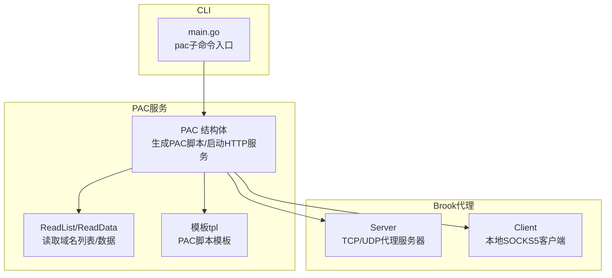
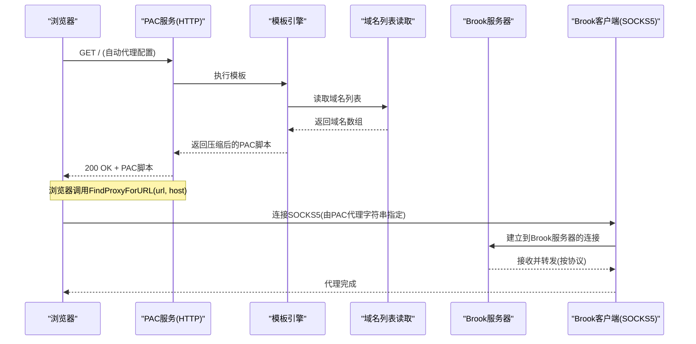
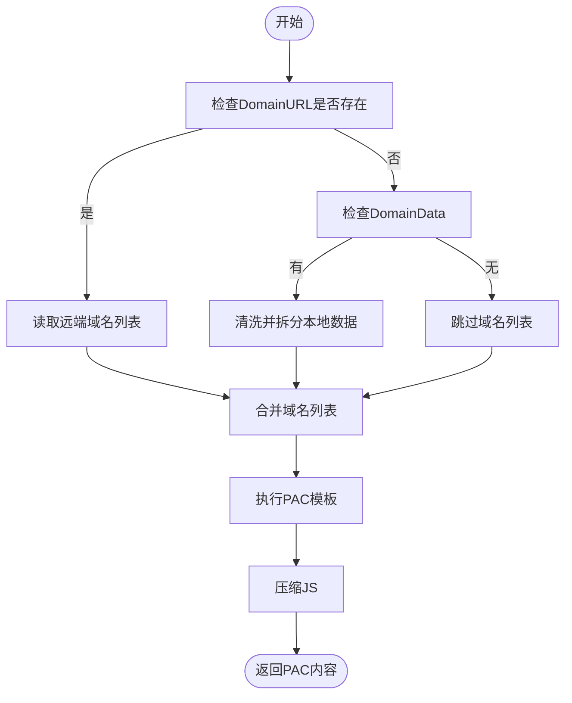
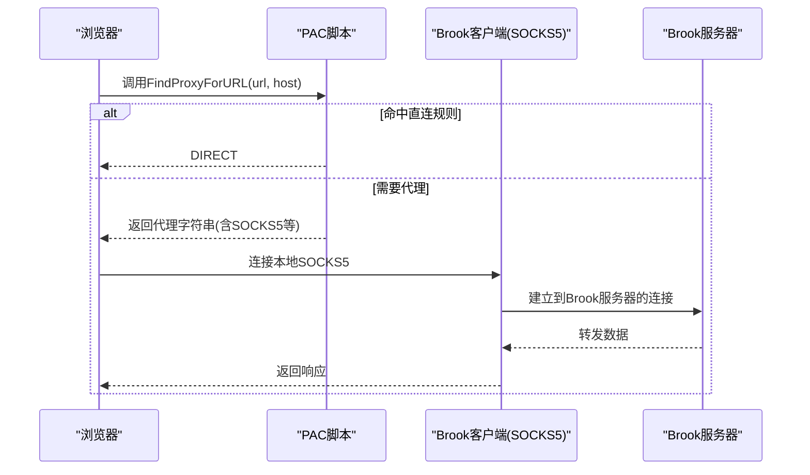
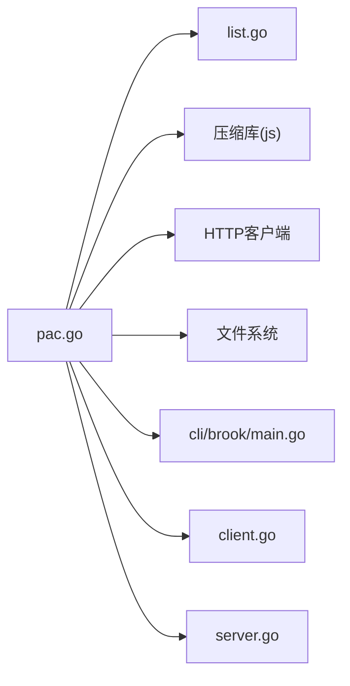

# PAC服务

<cite>
**本文引用的文件**
- [pac.go](file://pac.go)
- [list.go](file://list.go)
- [server.go](file://server.go)
- [client.go](file://client.go)
- [cli/brook/main.go](file://cli/brook/main.go)
- [README.md](file://README.md)
</cite>

## 目录
1. [简介](#简介)
2. [项目结构](#项目结构)
3. [核心组件](#核心组件)
4. [架构总览](#架构总览)
5. [详细组件分析](#详细组件分析)
6. [依赖关系分析](#依赖关系分析)
7. [性能考虑](#性能考虑)
8. [故障排查指南](#故障排查指南)
9. [结论](#结论)
10. [附录](#附录)

## 简介
本文件面向企业网络管理员与开发者，系统性地解析 Brook 中 PAC（Proxy Auto-Configuration）服务的设计与实现，重点说明 PAC 结构体中 Addr、File、Proxy、DomainURL、DomainData、HTTPServer 和 Body 字段的作用与协作方式；阐述 PAC 脚本的 JavaScript 逻辑与 Brook 代理服务器（server.go）及客户端（client.go）的协同工作机制；提供生成与部署 PAC 文件的方法、浏览器自动代理配置流程、大规模企业环境下的动态更新与缓存策略、安全风险防范与性能优化建议。

## 项目结构
围绕 PAC 功能的相关文件与职责如下：
- pac.go：PAC 服务核心实现，负责生成 PAC 脚本、启动 HTTP 服务、输出到文件或标准输出。
- list.go：域名列表读取与解析，支持从 HTTP(S) 或本地文件读取，统一格式化为字符串切片。
- server.go：Brook 代理服务器，提供 TCP/UDP 代理能力，作为 PAC 脚本所配置的代理链路之一。
- client.go：Brook 代理客户端，提供本地 SOCKS5 代理，作为 PAC 脚本所配置的代理链路之一。
- cli/brook/main.go：命令行入口，包含 pac 子命令，用于运行 PAC 服务或导出 PAC 文件。
- README.md：项目概览与使用指引。

图表来源
- [pac.go](file://pac.go#L31-L180)
- [list.go](file://list.go#L149-L200)
- [server.go](file://server.go#L25-L179)
- [client.go](file://client.go#L24-L144)
- [cli/brook/main.go](file://cli/brook/main.go#L2435-L2496)

章节来源
- [pac.go](file://pac.go#L31-L180)
- [list.go](file://list.go#L149-L200)
- [server.go](file://server.go#L25-L179)
- [client.go](file://client.go#L24-L144)
- [cli/brook/main.go](file://cli/brook/main.go#L2435-L2496)

## 核心组件
- PAC 结构体字段
  - Addr：PAC HTTP 服务监听地址。
  - File：导出 PAC 到文件时的目标路径。
  - Proxy：PAC 脚本中未命中直连规则时使用的代理字符串（可包含多个代理指令）。
  - DomainURL：远程域名列表源（HTTP/HTTPS），用于生成 PAC 中的直连域名集合。
  - DomainData：本地域名列表字节数据，优先于 DomainURL 使用。
  - HTTPServer：内置 HTTP 服务器实例，处理 / 请求并返回 PAC。
  - Body：已生成的 PAC 脚本内容（字节流），在内存中缓存以减少重复生成。

- PAC 方法
  - NewPAC：初始化 PAC 实例并配置 HTTP 路由与服务器参数。
  - MakeBody：读取域名列表、执行模板、压缩 JS，生成 PAC 内容。
  - ServeHTTP：响应浏览器对 PAC URL 的请求，设置正确的 Content-Type 并写入 Body。
  - ListenAndServe：生成一次 PAC 内容并启动 HTTP 服务。
  - Shutdown：优雅关闭 HTTP 服务。
  - WriteToFile/WriteToStdout：将生成的 PAC 写入文件或标准输出。

- 域名列表读取
  - ReadList：支持从 HTTP/HTTPS 或本地绝对路径读取域名列表，统一清洗与拆分。
  - ReadDomainList/ReadCIDRList：将域名列表转换为映射或 CIDR 列表，供其他模块复用。

章节来源
- [pac.go](file://pac.go#L31-L180)
- [list.go](file://list.go#L149-L200)

## 架构总览
PAC 服务在浏览器侧通过“自动代理配置”机制加载 PAC URL，PAC 脚本根据目标主机名判断是否直连或走代理。Brook 提供两类代理链路：
- 本地 SOCKS5 客户端：作为 PAC 代理字符串的一部分，将流量转发至 Brook 服务器。
- Brook 服务器：接收来自客户端的连接，按协议进行转发（TCP/UDP）。

图表来源
- [pac.go](file://pac.go#L61-L100)
- [list.go](file://list.go#L149-L200)
- [server.go](file://server.go#L140-L179)
- [client.go](file://client.go#L53-L144)

## 详细组件分析

### PAC 结构体与方法
- 字段解析
  - Addr：决定 PAC 服务监听的网络地址与端口，影响浏览器访问 PAC URL 的可达性。
  - File：当需要离线部署或批量分发 PAC 时，可将生成的脚本写入文件。
  - Proxy：PAC 脚本中的代理字符串，可包含多个代理指令（例如 SOCKS5/SOCKS/DIRECT），由浏览器按顺序尝试。
  - DomainURL/DomainData：二选一或组合使用，前者从远端拉取域名列表，后者直接使用本地字节数据。
  - HTTPServer：内置 HTTP 服务器，设置超时与空闲连接时间，保证服务稳定性。
  - Body：缓存生成好的 PAC 脚本，避免每次请求都重新生成与压缩。

- 关键流程
  - MakeBody：读取域名列表 -> 解析模板 -> 压缩 JS -> 返回 Reader。
  - ServeHTTP：设置 Content-Type 为 PAC 标准类型并写入 Body。
  - ListenAndServe：先生成 Body，再启动 HTTP 服务。
  - WriteToFile/WriteToStdout：用于离线部署或调试。

图表来源
- [pac.go](file://pac.go#L61-L95)
- [list.go](file://list.go#L149-L200)

章节来源
- [pac.go](file://pac.go#L31-L180)
- [list.go](file://list.go#L149-L200)

### PAC 脚本逻辑与浏览器协同
- 脚本结构要点
  - 变量 proxy：由 PAC 实例的 Proxy 字段注入，表示默认代理链路。
  - 变量 domains：由域名列表生成，用于后缀匹配，命中即直连。
  - 函数 FindProxyForURL(url, host)：
    - 若 host 为 IP 且属于私网/回环网段，直连。
    - 若 host 为简单主机名（无点），直连。
    - 逐级向右匹配域名后缀，命中则直连。
    - 否则返回 proxy（由浏览器按顺序尝试）。

- 与 Brook 的协同
  - 当 PAC 代理字符串包含 SOCKS5/SOCKS/DIRECT 时，浏览器会将非直连流量交由 Brook 客户端（本地 SOCKS5）处理。
  - Brook 客户端将请求转交给 Brook 服务器，服务器根据协议进行转发，最终到达目标站点。

图表来源
- [pac.go](file://pac.go#L144-L180)
- [client.go](file://client.go#L53-L144)
- [server.go](file://server.go#L140-L179)

章节来源
- [pac.go](file://pac.go#L144-L180)
- [client.go](file://client.go#L53-L144)
- [server.go](file://server.go#L140-L179)

### 命令行入口与部署
- pac 子命令
  - 支持 --listen 指定 PAC 服务监听地址。
  - 支持 --proxy 指定代理字符串。
  - 支持 --bypassDomainList 指定域名列表源（HTTP/HTTPS 或本地绝对路径）。
  - 支持 --file 将 PAC 写入文件，忽略监听地址。
  - 支持 --example 输出最小示例。

- 部署建议
  - 本地开发：使用 --listen 127.0.0.1:1980，便于本机调试。
  - 内网部署：使用内网 IP 与固定端口，确保浏览器可访问。
  - 离线部署：使用 --file 导出 PAC 文件，配合内网 Web 服务器发布。

章节来源
- [cli/brook/main.go](file://cli/brook/main.go#L2435-L2496)

## 依赖关系分析
- PAC 对外部依赖
  - 模板引擎：用于将 Proxy 与域名列表注入到 PAC 模板。
  - 压缩库：对生成的 PAC 脚本进行 JS 压缩，减小体积。
  - HTTP 客户端：用于从 HTTP/HTTPS 源读取域名列表。
  - 文件系统：用于写入 PAC 文件或读取本地域名列表。

- 组件耦合
  - PAC 与 list.go：通过 ReadList/ReadData 解耦域名来源（远端/本地）。
  - PAC 与 server.go/client.go：PAC 仅提供代理字符串，实际代理链路由客户端与服务器实现。
  - CLI 与 PAC：CLI 作为入口，负责参数解析与生命周期管理。

图表来源
- [pac.go](file://pac.go#L17-L39)
- [list.go](file://list.go#L149-L200)
- [cli/brook/main.go](file://cli/brook/main.go#L2435-L2496)
- [client.go](file://client.go#L24-L144)
- [server.go](file://server.go#L25-L179)

章节来源
- [pac.go](file://pac.go#L17-L39)
- [list.go](file://list.go#L149-L200)
- [cli/brook/main.go](file://cli/brook/main.go#L2435-L2496)
- [client.go](file://client.go#L24-L144)
- [server.go](file://server.go#L25-L179)

## 性能考虑
- 内存与CPU
  - Body 缓存：ListenAndServe 在启动前一次性生成并缓存 Body，避免每次请求重复生成与压缩。
  - 模板与压缩：仅在首次生成时执行模板解析与 JS 压缩，后续请求直接返回 Body。
  - 超时与空闲连接：HTTPServer 设置了合理的 ReadTimeout、WriteTimeout 与 IdleTimeout，降低资源占用。

- 网络与I/O
  - 域名列表读取：ReadList 对 HTTP/HTTPS 源设置了超时与自定义 DialContext，优先解析可用地址，失败时快速返回错误。
  - 本地文件读取：本地文件路径需为绝对路径，避免相对路径导致的不确定性。

- 大规模部署建议
  - 缓存策略：在反向代理层（如 Nginx/Caddy）缓存 PAC 文件，设置较长的缓存时间，减少后端压力。
  - 动态更新：通过定时任务或触发器定期更新域名列表，结合版本号或 ETag 机制，避免频繁全量下发。
  - 分发方式：优先使用内网 Web 服务器或 CDN 发布 PAC 文件，缩短首包延迟。

[本节为通用性能建议，不直接分析具体文件，故无章节来源]

## 故障排查指南
- 常见问题
  - 浏览器无法加载 PAC：检查 --listen 地址是否可达，确认浏览器自动代理配置 URL 正确。
  - 代理无效：核对 --proxy 参数格式，确保包含有效的代理指令（如 SOCKS5/SOCKS/DIRECT）。
  - 域名列表为空：检查 --bypassDomainList 是否为绝对路径或 HTTPS 地址，确认网络可达。
  - 生成失败：查看 MakeBody 的错误返回，定位域名列表读取或模板执行阶段的问题。

- 定位步骤
  - 使用 --file 导出 PAC 至本地，手动打开浏览器验证脚本语法与逻辑。
  - 使用 --example 查看最小示例，逐步添加参数进行对比。
  - 检查 CLI 参数校验：当传入的列表路径不符合要求时，CLI 会直接报错。

章节来源
- [cli/brook/main.go](file://cli/brook/main.go#L2471-L2496)
- [pac.go](file://pac.go#L61-L100)

## 结论
PAC 服务通过简洁的结构体与模板机制，将代理策略与域名列表解耦，既支持在线动态更新，也支持离线分发。结合 Brook 的本地 SOCKS5 客户端与服务器，PAC 能够灵活地将非直连流量引导至 Brook 代理链路。在企业环境中，建议采用内网 Web 服务器或 CDN 缓存 PAC 文件，配合定时更新与版本控制，实现稳定高效的自动代理配置。

[本节为总结性内容，不直接分析具体文件，故无章节来源]

## 附录

### 企业环境大规模部署范式
- 配置清单
  - PAC 服务：内网固定地址与端口，暴露给所有终端。
  - 代理链路：本地 SOCKS5 客户端指向 Brook 服务器，Brook 服务器监听内网地址。
  - 域名列表：集中维护，支持 HTTP/HTTPS 拉取与本地文件两种来源。
  - 缓存与CDN：PAC 文件缓存与分发，减少后端压力。
  - 动态更新：定时任务或事件驱动更新域名列表，结合版本号或 ETag 控制生效。

- 安全与合规
  - 限制 PAC 服务访问范围，仅允许内网访问。
  - 对远端域名列表源进行可信校验（如校验签名或证书），防止中间人攻击。
  - 代理链路启用鉴权与加密，避免明文传输。
  - 审计日志：记录 PAC 更新与访问情况，便于追踪与审计。

- 性能优化
  - 压缩与缓存：PAC 脚本压缩与长缓存。
  - 连接池与超时：合理设置 HTTP 客户端超时与连接池大小。
  - 负载均衡：多实例部署 PAC 服务，前端负载均衡。

[本节为通用实践建议，不直接分析具体文件，故无章节来源]